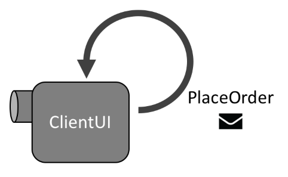

Sending and receiving messages is at the core of any NServiceBus system. Durable messages passed between processes allow reliable communication between those processes, even if one of them is temporarily unavailable. In this lesson we'll show how to send and process a message.


## Objectives

By the end of this lesson, you will have learned how to:

 * Define messages
 * Define message handlers
 * Send and receive a message locally
 * Use NServiceBus's logging capabilities


## What is a message?

A [**message**](/nservicebus/messaging/messages-events-commands.md) is a collection of data sent via one-way communication between two endpoints. In NServiceBus, we can define a message via a simple class.

In this lesson, we'll focus on the simpler type of message: [commands](/nservicebus/messaging/messages-events-commands.md#command). In [Lesson 4: Publishing events](../lesson-4/) we'll expand to look at events as well.

Defining a command is pretty easy. We just create a class and mark it with the `ICommand` marker interface.

snippet:Command

The marker interface has no implementation, but lets NServiceBus know that the class is a command so that it can build up some metadata about the message type when the endpoint starts up. Any properties you create within the message constitute the message data.

The name of the command class is also important. A command is an order to do something, so it should be named in the [imperative tense](https://en.wikipedia.org/wiki/Imperative_mood). `PlaceOrder`, `UpdateCustomerStatus`, and `ChargeCreditCard` are all great names for commands, because they are phrased as a command and are very specific. You can easily guess exactly what each of those messages will do. `UserMessage`, on the other hand, is not a good example. It is not in the imperative, and it's not very specific either. Another developer should know exactly what a command's purpose is just by reading the name.

When sending a message, the endpoint's [message serializer](/nservicebus/serialization/) will serialize an instance of the `DoSomething` class and add that to the contents of the outgoing message that goes to the queue. On the other end, the receiving endpoint will deserialize the message from JSON back to an instance of the message class so that it can be used in code.

Messages can support whatever data the serializer can successfully process. Thus messages can even contain child objects or collections.

snippet:ComplexCommand

Messages are a contract between two endpoints. Any change to the message will likely involve a change on both the sender and receiver side. The more properties you have on a message, the more reasons it has to change, so keep your messages as slim as possible.

Also, you should not embed logic within your NServiceBus message classes. Each message should contain only automatic properties and not computed properties or methods. Also, it is a good practice to instantiate collection properties from a default parameterless constructor as shown above, so that you never have to deal with a potentially null collection.

In essence, messages should be carriers for data only. This way, discovering a bug in logic will not require redeployment of every endpoint that uses a message.


## How do I organize messages?

Because messages must be shared between multiple endpoints, you generally should not put the classes in the same assembly with the endpoints. Instead, they should live in a separate class library so that they can be referenced by multiple endpoints without forcing those endpoints to take in additional dependencies.

A **message assembly** should contain only NServiceBus message contracts, and any supporting types required by the messages themselves. For example, a message may use an enumeration type for one of its properties; that enumeration should also live within the same message assembly.

Message assemblies should be entirely self-contained. They should have no dependencies other than libraries included with the .NET Framework, and the NServiceBus core assembly, which is required to reference the `ICommand` interface. Limiting dependencies makes your message contracts more resilient to future changes in the system.

NOTE: It's also possible to use [message conventions](/nservicebus/messaging/conventions.md) to identify message types, rather than the `ICommand` interface. Then a message assembly doesn't even need to reference NServiceBus at all. This can be an advantage when you want to upgrade to a new major version of NServiceBus, because message assemblies (which are shared between multiple endpoints) don't require any updates, so you can more easily update only one endpoint at a time.


## How do I process a message?

To process a message, we create a [**message handler**](/nservicebus/handlers/), a class that implements `IHandleMessages<T>`, where `T` is a message type. A message handler looks like this:

snippet:EmptyHandler

The implementation of the `IHandleMessages<T>` interface is the `Handle` method, which NServiceBus will invoke when a matching message (in this case `DoSomething`) arrives. The `Handle` method receives the message and an `IMessageHandlerContext` that contains tools for working with messages.

Of course, you can add the `async` keyword to a handler method, and then you do not need to explicitly return a task, as shown below. (If you are not comfortable working with async methods, you may want to check out [Asynchronous Handlers](/nservicebus/handlers/async-handlers.md) for more information.)

snippet:EmptyHandlerAsync

You can implement `IHandleMessages<T>` for multiple different message types within the same class, if it makes sense to logically group the handlers together. Just don't expect any state in class variables to be persisted. NServiceBus will create a new instance of the class for every message that it handles.

snippet:MultiHandler

When NServiceBus starts up, it will find all of these message handler classes and automatically wire them up, so that they will be invoked when messages arrive. There's no special setup or configuration needed.


## Exercise

Now let's take the "Hello world" solution we started in the last lesson and modify it to send a message. You can also grab the [completed solution from the last lesson](https://github.com/Particular/docs.particular.net/tree/academy-nsb101/tutorials/nservicebus-101/lesson-1/solution/) to use as a starting point.

When we're done, the ClientUI endpoint will be sending a PlaceOrder message to itself, and then processing that message, as depicted in the following diagram:




### Create a messages assembly

To share message between endpoints they need to be self-contained within a separate assembly, so let's create that assembly now.

 1. In the solution, create a new project and select the **Class Library** project type.
 1. Set the name of the project to **Messages**.
 1. Remove the automatically created **Class1.cs** file from the project. We would prefer to have our messages a little more organized than files in the root of the project. (More on this a little later.)
 1. Add the NServiceBus NuGet package to the Messages project.
 1. In the **ClientUI** project, add a reference to the **Messages** project.


### Create a message

In order to better organize messages, we'll create our first command in a folder called **Commands**.

 1. In the **Messages** project, create a new folder called **Commands**.
 1. In the **Commands** folder, add a new class named `PlaceOrder`.
 1. Mark `PlaceOrder` as `public` and implement `ICommand`.
 1. Add a public property of type `string` named `OrderId`.

NOTE: The .NET Framework contains another interface named `ICommand` in the `System.Windows.Input` namespace. Be sure that if you use tooling to resolve the namespace, you select `NServiceBus.ICommand`. Most of the types you will need will reside in the `NServiceBus` namespace.

When complete, your `PlaceOrder` class should look like the following:

snippet:PlaceOrder


### Create a handler

Now that we've defined a message, we can create a corresponding message handler. Rather than create a new endpoint, let's start by just handling the message locally within the **ClientUI** endpoint.

 1. In the **ClientUI** project, create a new class named `PlaceOrderHandler`.
 1. Mark the handler class as public, and implement the `IHandleMessages<PlaceOrder>` interface.
 1. Add a logger instance, which will allow you to take advantage of the same logging system used by NServiceBus. This has an important advantage over `Console.WriteLine()`: the messages you write with the logger will be written to the log file in addition to the console. Use this code to add the logger instance to your handler class:
    ```cs
    static ILog logger = LogManager.GetLogger<PlaceOrderHandler>();
    ```
 1. Within the `Handle` method, use the logger to record the receipt of the `PlaceOrder` message, including the value of the `OrderId` message property:
    ```cs
    logger.Info($"Received PlaceOrder, OrderId = {message.OrderId}");
    ```
 1. Since everything we have done in this handler method is synchronous, return `Task.CompletedTask`.

When complete, your `PlaceOrderHandler` class should look like this:

snippet:PlaceOrderHandler


### Send a message locally

Now we have a message and a handler to process it. Let's send that message!

In the **ClientUI** project, we are currently stopping the endpoint when we press the Enter key. Instead, let's create a run loop that will allow us to be a little more interactive, so that we can use the keyboard to decide whether to send a message or quit.

Add the following method to the **Program.cs** file:

snippet:RunLoop
 
Let's take a closer look at the case when we want to place an order. Since the `PlaceOrder` command is just a class, we can instantiate it normally, supplying a unique value for the `OrderId`. Then, after logging the details, we can send it with the `SendLocal` method.
    
`SendLocal(object message)` is a method that is available on the `IEndpointInstance` interface, as we are using here, and also on the `IMessageHandlerContext` interface, which we saw when we were defining our message handler. The *Local* part means that we are not sending to an external endpoint (in a different process) so we intend to handle the message in the same endpoint that sent it. Using `SendLocal()`, we don't have to do anything special to tell the message where to go.

NOTE: In the [next lesson](../lesson-3/) we'll learn how to send messages between separate endpoints, and how to control where the messages go.

Because `SendLocal()` returns a `Task`, we need to be sure to `await` it properly.
 
In order to use our `RunLoop` method, we need to replace the previous Console operations with a call to the new method in the `AsyncMain` method:

snippet:AddRunLoopToAsyncMain


### Running the solution

Now we can run the solution. Whenever we type `placeorder` on the console, a command message is sent and then processed by a handler class in the same project.

```no-highlight
INFO  ClientUI.Program Enter 'placeorder' to place an order, or 'quit' to quit.
placeorder
INFO  ClientUI.Program Sending PlaceOrder command, OrderId = 1ec12713-f86d-43e1-a41f-16aba19dd6f7
INFO  ClientUI.Program Enter 'placeorder' to place an order, or 'quit' to quit.
INFO  ClientUI.PlaceOrderHandler Received PlaceOrder, OrderId = 1ec12713-f86d-43e1-a41f-16aba19dd6f7
placeorder
INFO  ClientUI.Program Sending PlaceOrder command, OrderId = 9260d6ce-6f3e-4b00-9edb-0dfb905afee8
INFO  ClientUI.Program Enter 'placeorder' to place an order, or 'quit' to quit.
INFO  ClientUI.PlaceOrderHandler Received PlaceOrder, OrderId = 9260d6ce-6f3e-4b00-9edb-0dfb905afee8
```

Note how after sending a message, the prompt from `ClientUI.Program` is displayed _before_ the `ClientUI.PlaceOrderHandler` acknowledges receipt of the message. This is because, rather than calling the `Handle` method as a direct method call, the message is sent asynchronously, and then control immediately returns to the `RunLoop`, which repeats the prompt. It isn't until a bit later, when the message is received and processed, that we see the `Received PlaceOrder` notification.


## Summary

In this lesson we learned about messages, message assemblies, and message handlers. We created a message and a handler and we used `SendLocal()` to essentially send the message to ourselves.

In the next lesson, we'll create a second messaging endpoint, move our message handler over to it, and then configure the ClientUI to send the message to the new endpoint. We'll also be able to observe what happens when we send messages while the receiver endpoint is offline.

Before moving on, you might want to check your code against the completed solution (below) to see if there's anything you may have missed.

When you're ready, move on to [**Lesson 3: Managing multiple endpoints**](../lesson-3/).
