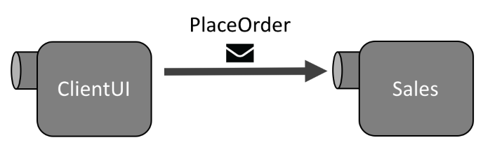

Up until this point, we have constrained our activities to a single endpoint, but this is not how real systems behave. The strength of a messaging application is the ability to run code in multiple processes, on multiple servers, which can all collaborate by exchanging messages.

In this lesson, we'll make our solution more "real life" by moving our message handler to a brand new messaging endpoint, and discussing the concepts that go along with running more than one endpoint.

## Objectives

By the end of this lesson, you will have learned:

* How to run multiple endpoints
* How to send messages between endpoints
* How to control the logical routing

## How do I send messages?

We've already shown how an endpoint can "send a message to itself" using the `SendLocal()` method, which is available on the `IEndpointInstance` that we use in the endpoint startup code to create a UI, and also on the `IMessageHandlerContext` that we can access while handling a message.

snippet:SendLocal

Sending a message to another endpoint is exactly the same, we just need to drop the word **Local** from the method name.

snippet:Send

The main difference is that with `SendLocal()`, the destination (local) for the message is already known. So when we call `Send()`, how does NServiceBus know where to send the message?

## Logical routing

We could specify where we want the message to go directly in code. There is actually an overload of the `Send()` method that allows us to do this:

snippet:SendDestination

However, doing that in most cases isn't a good idea. This requires each developer to remember where each message is supposed to go and type it in every time that message is sent.

Instead, NServiceBus should be made aware of the configuration, so that whenever a message is sent, the framework will already know exactly where it should be sent.

This is **logical routing**, the mapping of specific message types to logical endpoints that can process those messages. Each command message should have one logical endpoint that owns that message and can process it.

We say *logical routing* because this is at a logical layer only, which isn't necessarily the same as *physical routing*. Within one *logical* endpoint, there may be many *physical* endpoint instances deployed to multiple servers.

{{NOTE:
An **endpoint** is a logical concept, defined by an endpoint name and associated code, that defines an owner responsible for processing messages.

An **endpoint instance** is a physical instance of the endpoint deployed to a single server. Many endpoint instances may be deployed to many servers in order to scale out the processing of a high-volume message to multiple servers.
}}

For now we'll only concern ourselves with logical routing, and leave the rest of it (physical routing, scale-out, etc.) for a later time.

Because logical routing does not cover physical concerns, but only defines logical ownership, this is something that developers should control, and is not an operations concern. While operations may want to be able to move an endpoint to a different server using only configuration files, changing the owner for messages would require code changes and a recompile/redeploy anyway.

Therefore, it makes sense that logical routing is defined in code.

### Defining logical routes

Routing is a function of the message transport, so all routing functionality is accessed from the method that defines the message transport, as shown in this example using the MSMQ transport:

snippet:RoutingSettings

`RoutingSettings<T>` is scoped to the actual transport being used, and routing options are exposed as extension methods on this class. Therefore, only routing options that are viable for the transport in use will appear. Routing configurations only applicable to Microsoft Azure, for example, won't clutter up the API when using the MSMQ transport.

In order to define routes, start with the `routing` variable and call the `RouteToEndpoint` method as needed, which comes in three varieties:

snippet:RouteToEndpoint

For now we will use the first overload, specifying individual message types. In another course, we will explore how to best organize message types into assemblies in order to take advantage of the other overloads.

## Exercise

Let's split apart the endpoint we created in the previous lesson. We'll reconfigure our solution so that the **ClientUI** endpoint sends the `PlaceOrder` command to a new endpoint that we'll call **Sales**. Sales will become the true logical owner of the `PlaceOrder` command, and we'll get to see NServiceBus send a message from one endpoint to another.

### Creating a new endpoint

First, let's create the project for our new endpoint.

1. Create a new **Console Application** project named **Sales**.
2. In the **Sales** project, add the NServiceBus NuGet package:
        Install-Package NServiceBus -ProjectName Sales
3. In the **Sales** project, add a reference to the **Messages** project, so that we have access to the `PlaceOrder` message.

Now that we have a project for our Sales endpoint, we need to add similar code to configure and start an NServiceBus endpoint:

snippet:SalesProgram

Most of this configuration looks exactly the same as our ClientUI endpoint. It's critical for the configuration between endpoints to match (especially message transport and serializer) otherwise the endpoints would not be able to understand each other.

For example, if the ClientUI endpoint used `.UseSerialization<XmlSerializer>()` while the Sales endpoint used `.UseSerialization<JsonSerializer>()`, the Sales endpoint would not be able to understand the XML-serialized messages it received from ClientUI, because it would be expecting JSON instead.

While most of the configuration is the same, let me draw your attention to two specific lines that are different:

snippet:EndpointDifferences

The difference, of course, is the name "Sales" in the console title and `EndpointConfiguration` constructor, which defines the endpoint name for the Sales endpoint and gives it its own identity.

This means that the Sales endpoint will create its own queue named `Sales` where it will listen for messages. We now have two processes that each have their own mailbox, so now we can send messages between them.

NOTE: This is quite repetitive, but remember that this is still an introductory exercise. In the next course, we will explore methods that allow you to centralize most of this repetitive endpoint configuration code.

### Debugging multiple projects

At this point, we could run the Sales endpoint, although we wouldn't expect Sales to do anything except start up, create its queues, and then wait for messages that would never arrive. If you'd like, it's a good exercise to do, although you can skip it if you're in a hurry.

What you'll find, however, is that in NServiceBus solutions it's common to want to run multiple projects (endpoints) at once. While you can right-click each project separately, and select **Debug** > **Start new instance** for each one, many developers who have never run into this requirement before are not aware that Visual Studio allows you to run multiple projects when you debug.

To configure Visual Studio to start multiple projects when you start debugging:

1. Right-click the **RetailDemo** solution and select **Properties**.
2. On the left side of the **Property Pages** dialog, select **Common Properties** > **Startup Project**.
3. On the right, select the **Multiple startup projects** radio button.
4. In the list box's **Action** column, set the value to **Start** for the **ClientUI** and **Sales** projects. (It doesn't make sense to do so for **Messages**, as it is just a class library and can't be started directly.)

If you run the project now, you'll find that both ClientUI and Sales will start up. ClientUI will work just as it did before, and Sales will start up and wait for messages that will never arrive.

### Moving the handler 

Now let's move the handler from ClientUI over to Sales where it belongs.

1. In the Solution Explorer, find **PlaceOrderHandler.cs** in the **ClientUI** project, and drag it to the **Sales** project.
2. Open the new **PlaceOrderHandler.cs** in **Sales** and change the namespace from `ClientUI` to `Sales` to match its new home.
2. Visual Studio's default action when you drag files between projects is to copy them, so you must delete the old **PlaceOrderHandler.css** from the **ClientUI** endpoint.

So now that the handler is in the correct endpoint, what would happen if we started the solution? Sales now has a message handler, but recall that ClientUI is still calling `endpointInstance.SendLocal(command)` which effectively sends the message to itself, but it doesn't have a handler anymore.

If you attempt to place an order in the ClientUI, an exception will be thrown because ClientUI no longer has a handler for it:

WARNING: System.InvalidOperationException: No handlers could be found for message type: Messages.Commands.PlaceOrder

In fact, you will probably get a giant wall of exception text, because the message is tried and retried, and then retried some more after successively longer delays, until finally failing for good some time later. We'll cover this behavior in more detail in [Lesson 5: Retrying errors](../lesson-5/).

The important part is, this is a good thing! If we accidentally send a message to an endpoint we didn't intend, it won't just fail silently, lost forever to the nothingness of the great beyond.

### Sending to another endpoint

Now we need to fix up the ClientUI so that it is sending `PlaceOrder` to the Sales endpoint.

1. In the **ClientUI** endpoint, modify the **Program.cs** file so that `endpointInstance.SendLocal(command)` is replaced by `endpointInstance.Send(command)`.
2. In the `AsyncMain` method of the same file, change the call to use the MSMQ transport to access the routing configuration and specify the logical routing for `PlaceOrder` by changing your code as follows.
    
snippet:AddingRouting

This establishes that commands of type `PlaceOrder` should be sent to the **Sales** endpoint. While these two calls could be strung together in the same statement, there will commonly be multiple logical routes specified, so it's advantageous to assign the `routing` variable for future use.

### Running the solution

Now when we run the solution, we get two console windows, one for ClientUI and one for Sales. After moving them around so that we can see both, we can try to place an order by typing `placeorder` in the **ClientUI** window.

INFO: You can also keep console windows from showing up in random screen locations each time by right-clicking the console window's title bar, and in the **Layout** tab, unchecking the **Let system position window** checkbox.

In the **ClientUI** window, we see this output:

    INFO  ClientUI.Program Enter 'placeorder' to place an order, or 'quit' to quit.
    placeorder
    INFO  ClientUI.Program Sending PlaceOrder command, OrderId = 0f086be1-033b-4747-af53-192530005a1d
    INFO  ClientUI.Program Enter 'placeorder' to place an order, or 'quit' to quit.
    placeorder
    INFO  ClientUI.Program Sending PlaceOrder command, OrderId = ca953e37-573a-4a67-9258-bbd612ef8dad
    INFO  ClientUI.Program Enter 'placeorder' to place an order, or 'quit' to quit.

Everything is the same, except the command is not processed here.

In the **Sales** window, we see this:

    Press Enter to exit.
    INFO  Sales.PlaceOrderHandler Received PlaceOrder, OrderId = 0f086be1-033b-4747-af53-192530005a1d
    INFO  Sales.PlaceOrderHandler Received PlaceOrder, OrderId = ca953e37-573a-4a67-9258-bbd612ef8dad

Let's take a second and reflect upon what we've achieved. We've managed to create two processes and achieve inter-process communication between them. Compared to the amount of effort required to set up and configure a WCF service, NServiceBus is able to communicate between processes with amazing ease!

Now, let's try something different. Close the Sales endpoint window so that only ClientUI is running, and then enter `placeorder` several times to send several messages to the Sales endpoint. Note that it works just fine; messages are sent, and nothing fails because the Sales endpoint happens to be offline.

Now, restart the Sales endpoint and watch what happens. After it starts up, it receives and processes all the messages that were waiting for it in the queue.

It's really powerful to be able to take a part of your system offline and have the rest of it proceed normally as though nothing is wrong, and then have everything return to normal when the offline piece comes back online. Try that with WCF!

## Summary

In this lesson, we got our first true taste of sending messages between endpoints. We already knew the basics of how to send and handle messages, but we learned how to control the logical message routing so that when we send a message, the system will know where that message should go.

In the next lesson, we'll learn about events, a different kind of message that can be published to multiple subscribers using the Publish/Subscribe pattern. We'll also learn how the decoupling provided by this pattern allows us to structure our distributed systems in a more logical and maintainable way.

Before moving on, you might want to check your code against the completed solution (below) to see if there's anything you may have missed.

When you're ready, move on to [**Lesson 4: Publishing events**](../lesson-4/).
