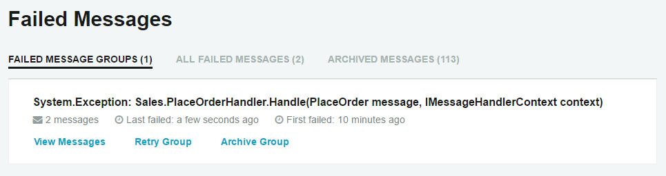
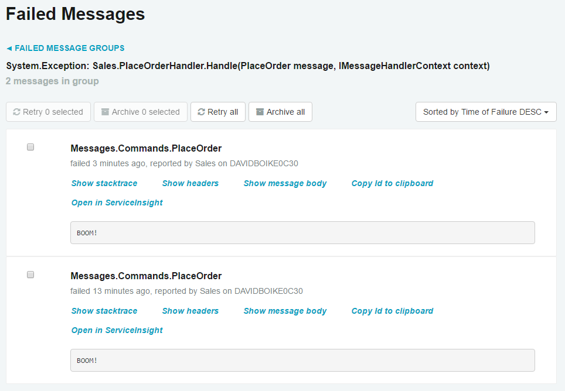

In software systems, exceptions are a fact of life. Even with perfect, bug-free code, problems will arise when we have to deal with the issue of connectivity. If a database is overloaded, or a web service is down, we have no recourse except to try again.

It's how we respond to exceptions that is important. When a database is deadlocked, or a web service is down, do we lose data, or do we have the ability to recover? Do our users get an error message and have to figure out how to recover on their own, or can we make it appear as though nothing ever went wrong?


## Objectives

By the end of this lesson, you will have learned:

 * The different causes of exceptions, and how to deal with them
 * How to use immediate retries to resolve transient errors
 * How to use delayed retries to resolve semi-transient errors
 * How to use message replay to resolve systemic errors


## Causes of errors

In systems programming, where connectivity is a major concern, there are generally three broad categories of exceptions:


### Transient exceptions

Transient exceptions are those that, if immediately retried, would likely succeed.

Let's consider a common scenario. You have some code that updates a record in the database. Two threads attempt to lock the row at the same time, resulting in a deadlock. The database chooses one transaction to succeed and the other fails. The exception message Microsoft SQL Server returns for a deadlock is this:

WARNING: Transaction (Process ID 58) was deadlocked on lock resources with another process and has been chosen as the deadlock victim. Rerun the transaction.

This is an example of a **transient exception**. Transient exceptions appear to be caused by random quantum fluctuations in the ether. If the failing code is immediately retried, it will probably succeed. Indeed, the exception message above tells us to do exactly that.


### Semi-transient exceptions

The next category involves failures such as connecting to a web service that goes down intermittently. An immediate retry will likely not succeed, but retrying after a short time (from a few seconds up to a few minutes) might.

These are **semi-transient exceptions**. Semi-transient exceptions are persistent for a limited time but still resolve themselves relatively quickly.

Another common example involves the failover of a database cluster. If a database has enough pending transactions, it can take a minute or two for all of those transactions to resolve before the failover can complete. During this time, queries are executed without issue, but attempting to modify data will result in an exception.

It can be difficult to deal with this type of failure, as it's frequently not possible for the calling thread to wait around long enough for the failure to resolve.


### Systemic exceptions

Outright flaws in your system cause **systemic exceptions**, which are straight-up bugs. They will fail every time given the same input data. These are our good friends NullReferenceException, ArgumentException, dividing by zero, and a host of other common mistakes we've all made.

In short, these are the exceptions that a developer needs to look at, triage, and fix—preferably without all the noise from the transient and semi-transient getting in the way of our investigation.


## Automatic retries

In order to deal with exceptions that arise within message handlers, NServiceBus wraps each message handler in a `try/catch` block, and if the message transport supports it, a transaction as well. This means that only one of two things can happen:

 1. The message is processed successfully. All database calls succeed, all outgoing messages are dispatched to the message transport, and the incoming message is removed from the queue.
 1. The message fails. All database transactions are rolled back, any calls to `.Send()` or `.Publish()` are cancelled, and the incoming message remains in the queue to attempt processing again.

With this kind of protection in place, we're free to try to process a message as many times as we need, or at least as many times as makes sense.

**Immediate retries** deal with transient exceptions like deadlocks. By default, messages will be immediately retried up to 5 times. If a handler method continues to throw an exception after 5 consecutive attempts, it is clearly not a transient exception.

**Delayed retries** deal with semi-transient exceptions, like a flaky web service, or database failover. It uses a series of successively longer delays between retries in order to give the failing resource some breathing room. After immediate retries are exhausted, the message is moved aside for a short time – 10 seconds by default – and then another set of retries is attempted. If this fails, the time limit is increased and then the message handler will try again.

All told, with default settings, delayed retries will attempt 4 rounds of immediate retries with delays increasing by 10 seconds for each round, resulting in 20 processing attempts in total:

 1. 5 processing attempts, followed by 10 second delay
 1. 5 processing attempts, followed by 20 second delay
 1. 5 processing attempts, followed by 30 second delay
 1. 5 processing attempts, then the message is moved to the error queue

The last step, moving the message to an error queue, is how NServiceBus deals with **systemic exceptions**. In a messaging system, systemic exceptions are the cause of **poison messages**, messages that cannot be processed successfully under any circumstances. Poison messages have to be moved aside, otherwise they will clog up the queue and prevent valid messages from being processed.

We'll take a look at a few options for configuring retries in the exercise, but for all the details check out the [recoverability documentation](/nservicebus/recoverability/).


## Replaying messages

Once a message is sent to the error queue, this indicates that a systemic failure has occurred. When this happens, a developer needs to look at the message and figure out *why*.

For this reason, NServiceBus embeds the exception details and stack trace into the message that it forwards to the error queue, so you don't even need to search through a log file to find the details – everything you need is right there! Once the underlying issue is fixed, the message can be replayed. **Replaying a message** sends it back to its original queue in order to retry message processing after an issue has been fixed.

NServiceBus comes with tools to make this kind of operational monitoring really easy. If you installed the rest of the [Particular Service Platform](http://particular.net/downloads), you already have these at your disposal:

 * [ServiceControl](/servicecontrol/) is like a brain monitoring your systems, sucking in information and making that available to other tools via a REST API. One of its functions is to monitor your error queue so that you can act on the poison messages that arrive there.
 * [ServicePulse](/servicepulse/) is a web application aimed to be an operational dashboard for your NServiceBus system. It allows you to see failed messages, including the exception details, and provides a UI to either replay or archive failed messages.

Sometimes, a new release will contain a bug in handler logic that isn't found until the code is deployed. When this happens, many errors can flood into the error queue at once. At these times, it's incredibly valuable to be able to rollback to the old version of the endpoint, and then replay the messages through proven code. Then you can take the time to properly troubleshoot and fix the issue before attempting a new deployment.


## Exercise

This is an exploratory exercise, where we'll be playing with different retry options. We'll use the [completed solution from the previous lesson](https://github.com/Particular/docs.particular.net/tree/academy-nsb101/tutorials/nservicebus-101/lesson-4/solution/).


### Throw an exception

For the purposes of this exercise, we'll create a specific bug in the Sales endpoint and watch what happens when we run the endpoint.

1. In the **Sales** endpoint, locate the **PlaceOrderHandler**.
2. After logging receipt of the message, throw an exception:

snippet:Throw

Now, run the solution.

 1. In Visual Studio's **Debug** menu, select **Detach All** so that the system keeps running, but does not break into the debugger when we throw our exception.
 1. In the **ClientUI** window, place an order by typing `placeorder`, and then watch carefully!

When we do these steps, we'll see a wall of exception messages in white text, which is log level INFO, followed by one in yellow text, which is log level WARN. The exception traces in white are the failures during immediate retries, and the last trace in yellow is the failure that hands the message over to delayed retries.

```no-highlight
INFO  Sales.PlaceOrderHandler Received PlaceOrder, OrderId = e927667c-b949-47ee-8ea2-f29523909784
WARN  NServiceBus.RecoverabilityExecutor Delayed Retry will reschedule message '53ac6836-48ef-49dd-aabb-a67c0104a2a5' after a delay of 00:00:10 because of an exception:
System.Exception: BOOM!
   at <stack trace>
```

10 seconds later, the retries begin again, followed by another yellow trace, sending the message back to delayed retries. 20 seconds after that, another set of traces. Finally, 30 seconds after that, the final exception trace will be shown in red, which is log level ERROR. This is where NServiceBus gives up on the message and redirects it to the error queue.

```no-highlight
INFO  Sales.PlaceOrderHandler Received PlaceOrder, OrderId = e927667c-b949-47ee-8ea2-f29523909784
ERROR NServiceBus.RecoverabilityExecutor Moving message '53ac6836-48ef-49dd-aabb-a67c0104a2a5' to the error queue 'error' because processing failed due to an exception:
System.Exception: BOOM!
   at < stack trace>
```


### Modify immediate retries

The only configurable option you need for immediate retries is how many of them to attempt. The default value is `5`, but you may want to set it to a higher or lower number. Many developers prefer to set it to `0` so that they can avoid the "wall of text" effect when an exception is thrown during development, and then set it to a higher number for production use.

 1. In the **Sales** endpoint, locate the **Program.cs** file.
 1. Before the endpoint is started, add the following code:

snippet:ImmediateRetries

Now, re-run the solution.

Notice how delayed retries still occur (with exception traces in yellow) but no immediate retries (in white) occur between each delayed retry.

Of course, the number of retries supplied to the immediate retries API can be pulled from an appSetting to allow changing configuration between development/test/staging/production environments.


### Modify delayed retries

Now let's try modifying the delayed retries. First let's try disabling them completely, which can also be beneficial during development to remove noise.

Modify the recoverability code you wrote previously, then re-run the solution:

snippet:DelayedRetries

Notice how the message is only attempted once. The stack trace is red, and the message is immediately forwarded to the error queue.

With delayed retries, we can also modify the time increase applied to each round of retries. Let's reset the number of delayed retries back to `3`, and decrease the time increase to 3 seconds so the delayed retries will occur very quickly.

Modify the same recoverability code, and re-run the solution:

snippet:TimeIncrease

Notice how much faster the message proceeds through delayed retries, because instead of delays of 10/20/30 seconds (60 seconds total) the delays are now 3/6/9 seconds, for a total of 18 seconds wait time.


### Replay a message

If you used the [Particular Platform Installer](/platform/installer/) to install MSMQ, you should already have the [ServiceControl](/servicecontrol/) and [ServicePulse](/servicepulse/) tools installed.

To check for these tools:

 * Load the ServiceControl API at [http://localhost:33333/api](http://localhost:33333/api). If a JSON response is returned, ServiceControl is running.
 * Load the ServicePulse application at [http://localhost:9090/](http://localhost:9090/). If a web application is displayed, ServicePulse is running.
 * If either tool is not installed, [reinstall the Particular Service Platform](/platform/installer/).

Once these tools are installed and running, you can attempt to replay a message:

 1. Fix the **Sales** endpoint by removing the `throw` statement.
 1. Run the solution.
 1. Open [ServicePulse](http://localhost:9090/) and navigate to the **Failed Messages** page. Note how similar messages are grouped together for easier handling.
    
 1. Click the **View Messages** link to see details on each failed message.
    
 1. Try the various methods of replaying messages and watch what happens in the console windows. Note that ServiceControl executes message retry batches on a 30-second timer, so *be patient!* Eventually, the messages will be returned to their appropriate endpoints.

When the message is replayed in Sales, each endpoint picks up right where it left off. You should be able to see how useful this capability will be when failures happen in your real-life systems.


## Summary

In this lesson, we explored different causes for exceptions and how NServiceBus makes those much easier to deal with by introducing automatic retries and message replay to make many transient and semi-transient exceptions just go away, and provide tools to deal with poison messages, all without our users noticing anything but perhaps a slight processing delay. This is a capability that will enable you to create truly resilient, self-healing systems that can keep running in the face of partial failure.

Congratulations! You've completed the last lesson in NServiceBus 101: Messaging Basics. You may have noticed in this course there was a lot of code duplication. We also ignored some messaging best practices in the name of keeping the examples simple. In the next course, we'll explore how you would use NServiceBus in a real-life system. We'll remove the code duplication and make everything more [DRY](https://en.wikipedia.org/wiki/Don%27t_repeat_yourself), discuss best practices for creating and managing large NServiceBus systems, delve into web applications, and more.

The next course isn't ready yet, but you can [sign up to receive updates](https://particular.net/s/new-course-signup) when we release additional courses.
