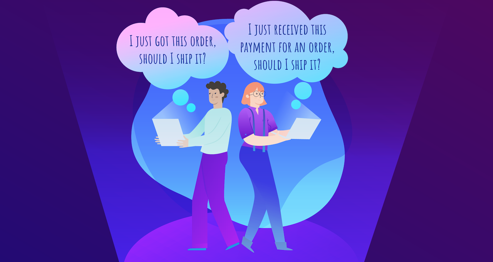

When you build a system with asynchronous messages, you divide each process into discrete message handlers that are executed when an incoming message arrives. Your system naturally becomes more reliable because each of these message handlers can be retried until they are successful. Additionally, it becomes easier to understand since each message handler handles just one specific task. This means  there's less code to keep in your head at any one time.

What happens when some process is dependent upon *more than one message*?



Let's say a **Shipping** service can't ship an order (that is, send a `ShipOrder` command) until it has successfully received `OrderPlaced` from the **Sales** service *and* `OrderBilled` from the **Billing** service. Normal message handlers don't store any state, so we need a way to keep track of which events have already been received.

In this tutorial, we'll solve this problem by building a simple [**saga**](/nservicebus/sagas/), which is essentially a message-driven state machine, or a collection of message handlers that persist shared state. Sagas represent a business process where multiple related messages can trigger state changes. Other lessons in this series will focus on other problems you can solve with sagas, such as integrating with external services or replacing nightly batch jobs with a system that processes changes in real time.

Let's get started building a saga!!


### Exercise

In this exercise we'll build a saga to handle the situation outlined above, where `OrderPlaced` and `OrderBilled` must both arrive before we can ship an order. We'll continue with the project from the [previous lesson](/tutorials/nservicebus-step-by-step/5-retrying-errors/) and extend it with an NServiceBus saga to handle the shipping process.

{{NOTE:
**What if I didn't do the previous tutorial?**

No problem! You can get started learning sagas with the completed solution from the previous lesson:

downloadbutton(Download Previous Solution, /tutorials/nservicebus-step-by-step/5-retrying-errors)

The solution contains 5 projects. **ClientUI**, **Sales**, **Billing**, and **Shipping** define endpoints that communicate with each other using NServiceBus messages. The **ClientUI** endpoint mimics a web application and is an entry point to the system. **Sales**, **Billing**, and **Shipping** contain business logic related to processing, fulfilling, and shipping orders. Each endpoint references the **Messages** assembly, which contains the classes defining messages exchanged in our system.

Check out the [NServiceBus step-by-step tutorial overview](/tutorials/nservicebus-step-by-step/) for a diagram of how the existing code works. Or,  if you like, you can complete those lessons first to learn the basics of sending messages and publishing events with NServiceBus and return to this lesson afterward.

Although NServiceBus only requires .NET Framework 4.5.2, this tutorial assumes at least Visual Studio 2017 and .NET Framework 4.6.1.
}}

We will create a saga in the **Shipping** endpoint that will handle the `OrderPlaced` and `OrderBilled` events. When it receives both, it'll send the `ShipOrder` command to initiate the delivery.

<div class="hype-resizer" hype-width="685" hype-height="500" style="margin:40px 0;">
    <div class="hype-inner" style="margin:0 auto;">
        <div id="saga-diagram-animation" style="position:relative;width:100%;height:100%;overflow:hidden;"></div>
    </div>
</div>
<script type="text/javascript" src="saga-diagram-animation/index.js"></script>


#### Sagas as policies

It's useful to think of sagas as **policies**. After all, the main use of a saga is to decide what to do once additional incoming messages arrive. Therefore it's useful to use the word **Policy** in a saga's name.

We're going to call this saga **ShippingPolicy** as it defines the policy around shipping an item, namely, that it requires the order be both *placed* and *billed*.

In our solution, these activities are currently happening in separate handlers. In the **Shipping** endpoint you should be able to find **OrderPlacedHandler** as well as **OrderBilledHandler**, both logging the fact that their respective messages arrived, but unable to decide what to do next without the help of the other.

The first thing we're going to do is reorganize these handlers into one class named **ShippingPolicy**.

1. In the **Shipping** project, delete **OrderPlacedHandler.cs** and **OrderBilledHandler.cs**.
1. Create a new class called `ShippingPolicy` in the Shipping project, containing a logger and implementing both the `IHandleMessages<OrderPlaced>` and `IHandleMessages<OrderBilled>` interfaces, which we'll implement in basically the same way as the classes we deleted:

snippet: EmptyShippingPolicy

We haven't done anything substantial yet, just reorganized two message handlers into one file. But unlike message handlers, sagas require state. Let's build that next.

#### Saga state

Sagas store their state in a class that inherits from `ContainSagaData` which automatically gives it a few properties (including an `Id`) required by NServiceBus. All the saga's data is represented as properties on the saga data class.

NOTE: We could implement `IContainSagaData` instead and create these required properties ourselves, but it's a lot easier to use the `ContainSagaData` convenience class.

We need to track whether or not we've received `OrderPlaced` and `OrderBilled`. The easiest way to do that is with boolean properties.

In the **Shipping** endpoint, let's create a new class called `ShippingPolicyData` that inherits from the `ContainSagaData` class, including properties to store information about events that have been received:

snippet: BasicShippingPolicyData

{{NOTE:
**Where do I put the `ShippingPolicyData` class?**

Saga data is private to the saga, since it stores state for a specific saga and cannot be used by any other component in the system. When designing a system, it is convenient to define saga data as a nested class inside the saga definition. This approach helps in strengthening the close relationship between the two artifacts. However, it is important to verify that your persistence and serialization choices support the use of nested classes.
}}

To tell the saga what class to use for its data, we inherit from `Saga<TData>` where `TData` is the saga data type. So for the `ShippingPolicy`, we'll inherit from `Saga<ShippingPolicyData>` like this:

snippet: ShippingPolicyAugmentedWithData

The `Saga<TData>` base class requires us to implement an abstract method called `ConfigureHowToFindSaga`. We'll get to this in a minute. For now we'll just insert a stub so that we can compile:

snippet: EmptyConfigureHowToFindSaga

With the base class in place, NServiceBus makes the current saga data available inside the saga using `this.Data`. Now that we can access the data, we can change each `Handle` method to update the saga data.

1. In the `Handle` method for `OrderPlaced`, add the statement `Data.IsOrderPlaced = true;`.
1. In the `Handle` method for `OrderBilled`, add the statement `Data.IsOrderBilled = true;`.

These two methods should now look like this:

snippet: HandleBasicImplementation

Notice we didn't have to worry about loading and unloading this data — that's done for us. NServiceBus loads the saga state from storage whenever a message related to the particular saga instance is received by an endpoint and then stores any changes after the message is processed. Later in this lesson, we'll explain how NServiceBus can determine saga state based on incoming messages.

NOTE: NServiceBus sagas are templates representing a process. At runtime, there can be multiple active instances, each representing the shipment process for a specific order. You can think about the distinction between saga and saga instance as similar to a class and object instance in C#. In this scenario there will be as many `ShippingPolicy` saga instances as there are shipments currently in progress.

Now, how do we determine how to start a saga?

#### How sagas start

When NServiceBus receives a message, it first looks for an existing saga that matches the message. If it can't find any related data, it needs to know whether it has permission to create a new instance of the saga. After all, the incoming message may be an out-of-date message for a saga that has already completed its work.

For this reason, we need to tell the saga which message types can start new saga instances. We do that by swapping the `IHandleMessages<T>` interface for `IAmStartedByMessages<T>` instead.

So clearly, because `OrderBilled` is not published until after Billing processes `OrderPlaced`, that means `OrderPlaced` must come first, and therefore, `OrderPlaced` is the only message type that can start our ShippingPolicy, right?

snippet: ShippingPolicyStartedBy1Message

_**Not so fast!**_

In message-driven systems, there's generally no way to guarantee message ordering. This is very different than when using the HTTP-based method invocation. In traditional synchronous systems we'd expect that messages are received in the same order as they are sent, i.e. `OrderPlaced` should be received by Shipping before `OrderBilled`. 

What happens if we're processing multiple messages in parallel? By sheer dumb luck, it's possible that `OrderBilled` may arrive first! If it happens that `OrderBilled` arrives first, it would be discarded, assumed to belong to an already-finished saga. Then, `OrderPlaced` would arrive and start a new saga instance, but its partner message would never arrive.

To ensure we are not making assumptions about which message comes first, we need to tell NServiceBus that **both** messages can start a new saga instance.

So, let's change our `ShippingPolicy` class so that instead of implementing `IHandleMessages<T>` we implement `IAmStartedByMessages<T>` for **both** messages instead:

snippet: ShippingPolicyStartedBy2Messages

The `IAmStartedByMessages<T>` interface implements the `IHandleMessages<T>` interface already, so we don't need to make any other code changes to make the swap. Now the NServiceBus infrastructure knows that a message of *either* type can create a new saga instance if one doesn't already exist. The `IHandleMessages<T>` interface requires a saga instance to exist *already*. If no matching saga instance is found, then the incoming message will be ignored.

NOTE: See [Sagas Not Found](/nservicebus/sagas/saga-not-found.md) for more details about what happens when NServiceBus can't find a saga instance for a message.

#### Matching messages to sagas

Wait a minute! How can NServiceBus know that a saga instance already exists for a specific incoming message?

We need to tell our saga how to recognize which messages are related to the same saga instance. When you made the `ShippingPolicy` saga inherit from the `Saga<T>` base class you were required to implement an abstract method provided by the base class: `ConfigureHowToFindSaga`. Now it's time to fill that in.

The `ConfigureHowToFindSaga` method configures mappings between incoming messages and a saga instances based on message properties. In our scenario both `OrderPlaced` and `OrderBilled` events have an `OrderId` property that is a unique order identifier. It's a perfect, natural candidate for correlating messages to saga instances.

The first thing we need to do is extend the `ShippingPolicyData` class to keep track of the `OrderId` when storing state information:

snippet: ExtendedShippingPolicyData

We define a mapping between an incoming message and saga data in the `ConfigureMapping` method using the `mapper` parameter, using an expression like this:

snippet: ConfigureHowToFindSagaSampleAPI

The first expression `message => message.MessagePropertyName` allows NServiceBus to inspect a message and pull out a property value, the value of `MessagePropertyName`. The second expression `.ToSaga(sagaData => sagaData.SagaPropertyName)` allows NServiceBus to create (in relational database terms) a query similar to the following:

```sql
select * from SagaDataTable
where SagaPropertyName = @MessagePropertyValue
```

In our case, we can use `OrderId` as our **correlation id**. Let's update our `ConfigureHowToFindSaga` method to use `OrderId` as both the message property and saga property:

snippet: ShippingPolicyFinalMappings

{{NOTE:
In the `ToSaga` expression, it's required that every mapped message maps to the same saga data property. In other words, it's not valid to have one message type map to `sagaData.PropertyA` and another message type map to `sagaData.PropertyB`.

Unlike the example here, the same property name doesn't have to be used on the message mapping expression, but it certainly makes everything easier if they all match. It is fairly common, especially when integrating events from different teams, to have different message property names that describe the same fundamental concept.
}}

Our mappings specify that whenever a message of type `OrderPlaced` is received, the infrastructure needs to use the incoming message `OrderId` property value to look up the saga instance with the id that matches the given `OrderId`. If the saga instance doesn't exist and the message is configured to create a new one, NServiceBus will use the value of the order it property from the incoming message as a correlation id for the new saga.

##### Auto-population

One thing we **do not** have to worry about is filling in `OrderId` in the saga data. We've already told NServiceBus that `OrderPlaced` and `OrderBilled` can start the saga. We've instructed it to look up data based on the `OrderId` of the incoming message. Because it knows these things, when it creates a new `ShippingPolicyData` it knows what the value of the `OrderId` property should be, and fills it in for us.

So code like this is **not required**:

snippet: ShippingPolicyCorrelationAutoPopulation

Less boilerplate is a good thing. Let's concern ourselves with more important things, like what to do after both `OrderPlaced` and `OrderBilled` have been received.

#### Orders processing and saga completion

Right now the `ShippingPolicy` saga does nothing else other than handling messages and keeping track of which messages have been handled. Once both messages are received, we need to deliver the order.

First, in the **Messages** project, create a `ShipOrder` command:

snippet: ShippingPolicyShipOrder

Next, let's add a `ProcessOrder` method to the saga to handle the order delivery:

snippet: ShippingPolicyProcessOrder

NOTE: Here we're using `SendLocal()` to send the `ShipOrder` command to the same endpoint that is processing the saga message. This means we don't have to specify any routing rules for the `ShipOrder` command. We could also use `Send()`, but then we would need to define routing rules just as we did in the [step-by-step tutorial on multiple endpoints](/tutorials/nservicebus-step-by-step/3-multiple-endpoints/#exercise-sending-to-another-endpoint), where we defined a route in the **ClientUI** endpoint to send `PlaceOrder` commands to the **Sales** endpoint.

In the `ProcessOrder` method we check if both messages have been received. In such a case the saga will send a message to deliver the order. For this specific `OrderId` the shipment process is now complete. We don't need that saga instance anymore, so it can be safely deleted by invoking the `MarkAsComplete` method.

Now, let's modify each of our `Handle` methods so that they call `ProcessOrder` instead of returning `Task.CompletedTask`:

snippet: ShippingPolicyFinalHandleWithProcessOrder

We also want to be able to handle the `ShipOrder` command we're sending from the saga. In the **Shipping** endpoint create a new handler class named `ShipOrderHandler`. Here's how:

snippet: EmptyShipOrderHandler

#### Saga persistence

Before being able to fully run the solution and test if the `ShippingPolicy` saga is working as expected, you need to configure one last thing: *Saga persistence*.

Saga state needs to be persisted, so we need to configure the **Shipping** endpoint with a chosen persistence. In the `Program` class where there is the endpoint configuration code, add the following line after the transport configuration:

snippet: ShippingEndpointConfigLearningPersistence

The snippet above is configuring the endpoint to use `LearningPersistence` which is designed for testing and development. It stores data on the disk in a folder in the executable path. In production use one of [our production-level persistence options](/persistence/#supported-persisters).


#### Running the solution

You can now press <kbd>F5</kbd> and test the `ShippingPolicy` saga. By sending a new order from the ClientUI endpoint you should see the following message flow:

* The `PlaceOrder`command is sent from ClientUI to Sales.
* Sales publishes the `OrderPlaced` event that is handled by Billing and Shipping.
* Billing processes the payment and publishes the `OrderBilled` event.
* Shipping handles `OrderPlaced` and `OrderBilled` using the `ShippingPolicy` saga.
* When both are handled by the saga, the `ShipOrder` command is sent.

The **Shipping** endpoint console should show the following output:

```
INFO  Shipping.ShippingPolicy OrderPlaced message received.
INFO  Shipping.ShippingPolicy OrderBilled message received.
INFO  Shipping.ShipOrderHandler Order [0b0dd421-4661-46e7-abc5-c92c43b8fd18] - Successfully shipped.
```

Remember that it's possible that `OrderBilled` may be handled before `OrderPlaced`, which is why it was so critical to indicate that the saga can be started by both messages with `IAmStartedByMessages<T>`. This ensures that the saga will work correctly no matter the arrival order of the events.

### Summary

In this lesson, we learned to think of sagas as a tool to implement a business policy. _An order cannot be shipped until it is both **accepted** and **billed**._ We want sagas to react to messages, evaluate business rules, and make decisions that allow the system to move forward. It's generally better to think of sagas as policies rather than as orchestrators or process managers.

Using an NServiceBus saga, we designed a state machine to satisfy these business requirements. As a message-driven state machine, a saga is a perfect way to implement a business policy as it describes the conditions that must be satisfied in order to make a decision.

In the next lesson we'll see how [using timeouts](/tutorials/nservicebus-sagas/2-timeouts/) enables us to add the dimension of time to our business policies, allowing us to send messages into the future to wake up our saga and take action, even if nothing else is happening.
