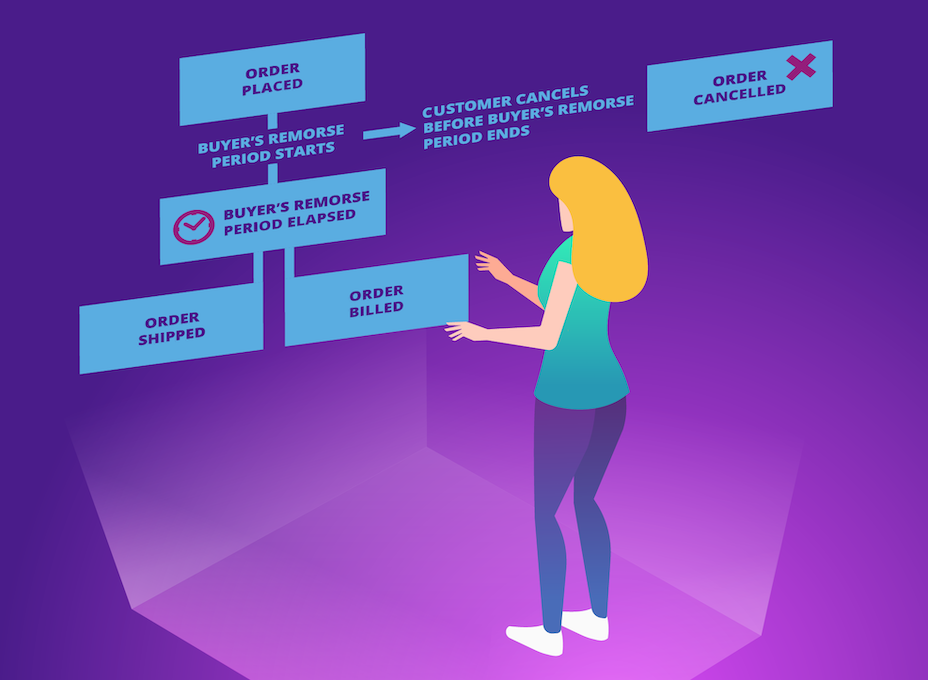

Being able to model the concept of time as part of a long-running process is incredibly powerful. Batch jobs are a feeble attempt at this. They fail at handling things in real-time and make every instance of a long-running process dependent on every other instance. What if the batch job fails?

> [!NOTE]
> For more on the difficulties associated with batch jobs, see [Death to the Batch Job](https://particular.net/blog/death-to-the-batch-job).

In addition to sending and publishing messages, NServiceBus can also [delay messages](/nservicebus/messaging/delayed-delivery.md). Delayed delivery effectively provides the ability to *send messages into the future*, a feature used by [Saga Timeouts](/nservicebus/sagas/timeouts.md).

There's no need to write batch jobs to query data every night. Instead, each instance is able to manage time in its own workflow, setting virtual alarm clocks to do something.

> [!NOTE]
> The delivery of a delayed message is not guaranteed to occur at the specified point in time. It may be delayed further if the system is very busy at that time.

The use cases for saga timeouts are too numerous to count. So, in this tutorial, we will focus on implementing the [buyer's remorse pattern](https://en.wikipedia.org/wiki/Buyer%27s_remorse). In this pattern, customers who purchased something can cancel their order within a certain amount of time after it was placed. This is an important software pattern that pops up in non-retail domains as well. For example, Gmail uses the same pattern for their [Undo Send feature](https://support.google.com/mail/answer/2819488?co=GENIE.Platform%3DDesktop&hl=en).

With the buyer's remorse pattern, the purchase is kept in a holding state until after a defined delay. The order isn't *really* sent until the timeout has expired.

## Exercise

In this tutorial, we'll model the delay period using a saga timeout. We'll change the existing project so that when the **Sales** endpoint receives the `PlaceOrder` command, we don't instantly publish the `OrderPlaced` event. Instead, we'll store the order state in a saga and set a timeout to do that in the future. When the timeout is due, we'll publish the `OrderPlaced` event, unless we've received a `CancelOrder` command in the meantime.

> [!NOTE]
> **What if I didn't do the previous tutorial?**
>
> No problem! You can get started learning sagas with the completed solution from the [previous lesson](/tutorials/nservicebus-sagas/1-saga-basics/):
>
> downloadbutton(Download Previous Solution, /tutorials/nservicebus-sagas/1-saga-basics)
>
> The **ClientUI**, **Sales**, **Billing**, and **Shipping** projects define endpoints that communicate with each other using messages. The **ClientUI** endpoint mimics a web application and is the entry point to the system.
> **Sales**, **Billing**, and **Shipping** contain business logic related to processing, fulfilling, and shipping orders. Each endpoint references the relevant **.Messages** assembly, which contains the classes that define the messages exchanged in our system.
> To see how to start building this system from scratch, check out the [NServiceBus step-by-step tutorial](/tutorials/nservicebus-step-by-step/).
>
> This tutorial uses NServiceBus 10, .NET 10, and assumes an up-to-date installation of Visual Studio 2026.

### Saga storage

Saga state must be persisted somewhere. There are various persistence options, but for this tutorial, the `LearningPersistence` is used. This is a simple persistence option for educational purposes and is *not* suited for production use.

In the Sales project, open `Program.cs` and add the following configuration setting:

snippet: BuyersRemorseEnableSagaPersistence

### BuyersRemorsePolicy saga

In the Sales project, create a new class called `BuyersRemorsePolicy` and add the following code:

snippet: EmptyBuyersRemorsePolicy

The policy inherits from `Saga<BuyersRemorseData>`. `BuyersRemorseData` represents the saga's state by inheriting from `ContainsSagaData`.

The ClientUI already sends a `PlaceOrder` command to the Sales endpoint. This command is perfect to start the buyer's remorse saga. Let's implement the `IAmStartedByMessages<PlaceOrder>` interface in the saga:

snippet: BuyersRemorsePolicyStartedByPlaceOrder

Next, we need a way to map messages to sagas so we know which saga instances a particular message belongs to. We do this with the `ConfigureHowToFindSaga` method and, in this case, we already have a natural mapping field: `OrderId`.

snippet: BuyersRemorsePolicyMapping

Now let's implement our policy.

### Timeout request and handling

Our next step is to tell our `BuyersRemorsePolicy` to schedule a message to tell us when the buyer's remorse period is over. We do this with the `RequestTimeout` method. Modify the `Handle` method of `BuyersRemorsePolicy` as follows:

snippet: BuyersRemorseTimeoutRequest

Besides the `context`, the `RequestTimeout` method has two interesting parameters. One is the `TimeSpan` which tells us how long to wait before sending our timeout message. In this case, it's 20 seconds.
> [!NOTE]
> This tutorial uses 20 seconds as a timeout value for simplicity. In production, a business-enforced rule should determine the length of this period.

> [!NOTE]
> Instead of a `TimeSpan`, we could provide a `DateTime` instance, such as `DateTime.UtcNow.AddDays(10)`. When using this format, remember that local time is affected by Daylight Savings Time (DST) changes, so use UTC dates instead to avoid DST conversion issues.

The other interesting parameter is the message that will be sent when the timeout elapses. In this case, we are providing an instance of `BuyersRemorseIsOver`, a class which is not yet defined. Let's define it now. You can put it at the end of the file of our saga and leave it as an empty class:

snippet: BuyersRemorseTimeoutClassDefinition

This class is a message like any other message (e.g. `OrderPlaced`), but it's specific to our saga, so we'll keep it here with the rest of the code. If we needed more data, we could add properties to it to be included with the message.

The effect of these changes is that in 20 seconds, we will send a `BuyersRemorseIsOver` message back to the saga. Next, we'll see what to do with this message when we receive it.

#### Timeout handling

Handling a timeout method is similar to how other handlers work. But instead of implementing a `Handle` method, we implement a `Timeout` method by implementing `IHandleTimeouts<BuyersRemorseIsOver>`:

snippet: BuyersRemorseTimeoutHandling

The code in the `Timeout` method is business logic; stuff that is supposed to happen when an order is placed. When we're done, we publish an `OrderPlaced` event to notify any subscribers that something important has occurred. Remember, our `ShippingPolicy` saga still needs to know that an order has been placed so it can be shipped.

The last line of the method is a call to the `MarkAsComplete` method. This is important because it tells the saga instance that it's finished. Any further messages to this instance will be ignored because there is no further work to be done for the saga. We'll return to this concept in the next section when handling cancellation.

We now have a working buyer's remorse policy, so we don't need our existing `PlaceOrderHandler`. Delete this class from the Sales project.

But it's not much of a buyer's remorse policy if we can't cancel the order. Let's do that now.

### Order cancellation

As you might expect by now, cancelling an order is done by sending a command and handling it. First, define the `CancelOrder` command in the **Sales.Messages*** project:

snippet: BuyersRemorseCancelOrderCommand

We handle `CancelOrder` in the `BuyersRemorsePolicy` saga by implementing `IHandleMessages<CancelOrder>`. We also need to tell the saga how to map a `CancelOrder` command to a saga instance, which we can do with the `OrderId` property, just as we did with the `PlaceOrder` command:

snippet: BuyersRemorseCancelOrderHandling

The `Handle` method is very similar to the saga's `Timeout` method. We log some information, execute some business logic, then mark the saga complete. This effectively cancels any outstanding timeouts currently in place for the saga. Remember, by calling `MarkAsComplete`, we tell this saga instance that there is no further work to be performed.

If the system is busy, the cancellation message may be processed *after* the timeout message, even though the cancellation message was sent before the timeout message was due. The shorter the timeout duration is, the higher the probability is of this occurring.
Consider what happens when the buyer's remorse period has ended. The saga has been marked complete, but maybe the Cancel button still appears on the user's screen and they click it. Assuming a `CancelOrder` command is fired, nothing will happen. The saga instance is already complete so the message is discarded. In effect, we can't cancel an order that has already been placed. Similarly, we can't complete an order that has already been processed. `MarkAsComplete` handles both of these scenarios for us.

> [!NOTE]
> Technically, it's not true that _nothing_ will happen when a saga message is received after the instance has completed. We can implement the `IHandleSagaNotFound` interface to [perform logic](/nservicebus/sagas/saga-not-found.md) in these scenarios. For example, we could inform the customer that the buyer's remorse period has ended so the order can no longer be cancelled.

> [!NOTE]
> Although we don't show it here, we may want to send an `OrderCancelled` event in the `Handle` method to indicate that an order has been cancelled. In this sample, we have no business process for cancelled orders, so we don't fire the event.

Finally, let's update the UI so that our customers can take advantage of our buyer's remorse policy.

#### Allow the UI to cancel orders

Now we need to modify ClientUI to send a `CancelOrder` command. First, we define the routing for the command in the `Program` class:

snippet: BuyersRemorseCancelOrderRouting

To allow users to cancel orders, we'll modify the ClientUI  class to:

* store the ID of the sent order
* accept another command, `cancel`, that uses the previously stored ID to cancel the sent order

The new loop looks like this:

snippet: BuyersRemorseCancellingOrders

We now have a working buyer's remorse policy!

## Summary

At this point, the solution is ready for placing and cancelling orders. Press <kbd>F5</kbd> and test that you can place and cancel (within 20 seconds) orders. If everything is working, here's what will happen:

* A `PlaceOrder` command is delivered from ClientUI to Sales
* Sales triggers a 20 second timeout and logs the information
* When the timeout expires:
  * an `OrderPlaced` event is published by Sales
  * the `BuyersRemorsePolicy` saga is marked as completed
* If a `CancelOrder` command is sent from ClientUI to Sales before the timeout period, the order will be cancelled by marking the `BuyersRemorsePolicy` saga as completed

In the next lesson, we'll see how we can keep our solution robust even if we integrate with third-party services.
