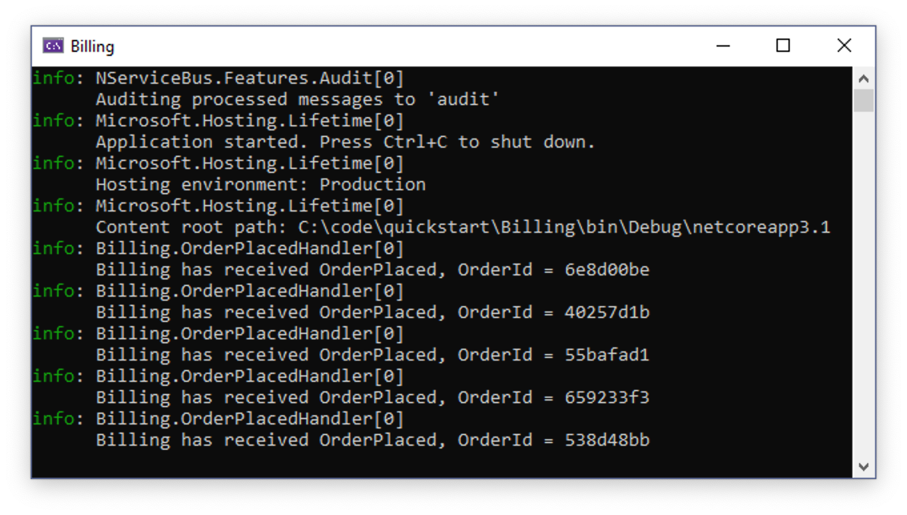
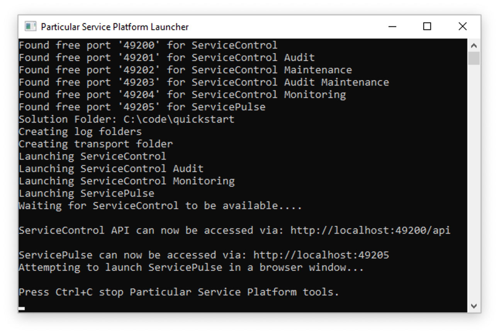
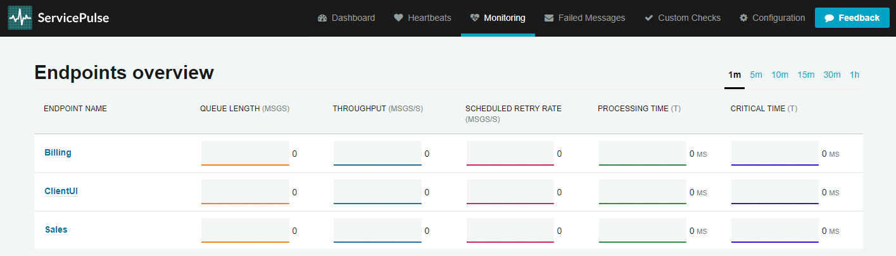
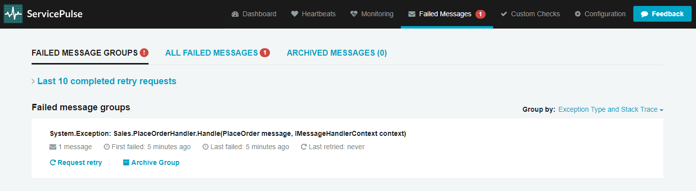

## Recovering from failure

In [Part 1 of this tutorial](/tutorials/quickstart), you reviewed the project structure of a typical distributed system solution and saw how messages flow across [endpoints](/nservicebus/endpoints/). Here, you will learn how to recover when the flow is disrupted by a failure.

One of the most powerful advantages of asynchronous messaging is reliability. Failures in one part of a system aren't propagated and won't bring the whole system down.

If you didn't already download the Quick Start solution in the [previous lesson](/tutorials/quickstart), you can download it now:

downloadbutton

## How do NServiceBus systems recover?

1. Stop the solution (if you haven't already) and then in Visual Studio's **Debug** menu, select **Start Without Debugging** or use <kbd>Ctrl</kbd>+<kbd>F5</kbd>. This will allow us to stop one endpoint without Visual Studio closing all three.
2. Close the **Billing** window.
3. Send several messages using the button in the **ClientUI** window.
4. Notice how messages are flowing from **ClientUI** to **Sales**. **Sales** is still publishing messages, even though **Billing** can't process them at the moment.


5. Restart the **Billing** application by right-clicking the **Billing** project in Visual Studio's Solution Explorer, then selecting **Debug** > **Start new instance**.

> [!NOTE]
> For Visual Studio Code users, the **Billing** endpoint can be started by navigating to the _Run and Debug_ tab and selecting the _Billing_ launch configuration from the dropdown list. Be sure to re-select the _Debug All_ configuration again after _Billing_ is running.

When the **Billing** endpoint starts, it will pick up messages published earlier by **Sales** and will complete the process for orders that were waiting to be billed.



Let's consider more carefully what happened. First, you had two processes communicating with each other with very little ceremony. The communication didn't break down even when the **Billing** service was unavailable. Had you implemented **Billing** as a REST service, for example, the **Sales** service would have thrown an HTTP exception when it was unable to communicate, *resulting in a lost request*. By using NServiceBus you get a guarantee that even if message processing endpoints are temporarily unavailable, every message will eventually get delivered and processed.

## Transient failures

Have you ever had business processes get interrupted by transient errors like database deadlocks? Transient errors often leave a system in an inconsistent state. For example, an order could be persisted in the database but not yet submitted to the payment processor. In such a situation you may have to investigate the database like a forensic analyst, trying to figure out where the process went wrong, and how to manually jump-start it so the process can complete.

With NServiceBus you don't need manual intervention. If an exception is thrown, the message handler will automatically attempt a retry. The automatic retry process addresses transient failures like database deadlocks, connection issues, file write access conflicts, etc.

Let's simulate a transient failure in the **Sales** endpoint and see the retry process in action:

1. Stop the solution if you haven't already. Locate and open the **PlaceOrderHandler.cs** file in the **Sales** endpoint.
1. Uncomment the code inside the **ThrowTransientException** region shown below. This will cause an exception to be thrown 20% of the time a message is processed:

snippet: ThrowTransientException

3. Start the solution without debugging (<kbd>Ctrl</kbd>+<kbd>F5</kbd>). This will make it easier to observe exceptions occurring without being interrupted by Visual Studio's Exception Assistant dialog. If you are using Visual Studio Code, the browser window may not reopen. If this is the case, open [http://localhost:5000](http://localhost:5000) in a new tab.
4. In the **ClientUI** window, send one message at a time, and watch the **Sales** window.


As you can see in the **Sales** window, 80% of the messages will go through as normal, but when an exception occurs, the output will be different. The first attempt of `PlaceOrderHandler` will throw and log an exception, but then in the very next log entry, processing will be retried and likely succeed.

```
INFO Immediate Retry is going to retry message '5154b012-4180-4b56-9952-a90a01325bfc' because of an exception:
System.Exception: Oops
    at <long stack trace>
INFO Received PlaceOrder, OrderId = e1d86cb9
```

> [!NOTE]
> If you didn't detach the debugger, you must click the **Continue** button in the Exception Assistant dialog before the message will be printed in the **Sales** window.

5. Stop the solution and re-comment the code inside the **ThrowTransientException** region, so no exceptions are thrown in the future.

Automatic retries allow you to avoid losing data or having your system left in an inconsistent state because of a random transient exception. You won't need to manually dig through the database to fix things anymore!

Of course, there are other exceptions that may be harder to recover from than simple database deadlocks. Let's see what happens when a systemic failure occurs.

## Systemic failures

> [!WARNING]
> In order to use the portable version of the Particular Service Platform included in this tutorial, you'll need to use a Windows operating system.

A systemic failure is one that is simply unrecoverable, no matter how many times we retry. Usually these are just plain old bugs. Most of the time these kinds of failures require a redeployment with new code in order to fix them. But what happens to the messages in this case?

> [!NOTE]
> For a good introduction to different types of errors and how to handle them with message-based systems, see [I caught an exception. Now what?](https://particular.net/blog/but-all-my-errors-are-severe)

Let's cause a systemic failure and see how you can use the Particular Service Platform tools to handle it.

First, let's simulate a systemic failure in the **Sales** endpoint:

1. In the **Sales** endpoint, locate and open the **PlaceOrderHandler.cs** file.
2. Uncomment the code inside the **ThrowFatalException** region shown here. This will cause an exception to be thrown every time the `PlaceOrder` message is processed:

snippet: ThrowFatalException

3. In the `Handle` method, comment out all the code past the `throw` statement so that Visual Studio doesn't show a warning about unreachable code.

Next, let's enable the Particular Service Platform tools and see what they do.

1. In the **PlatformLauncher** project, locate and open the **Program.cs** file.
2. Within **Main**, replace the line `await Task.CompletedTask;` with `await Particular.PlatformLauncher.Launch();`. This is responsible for launching the platform when we start our project.

snippet: PlatformMain

With any necessary changes made, start the solution without debugging (<kbd>Ctrl</kbd>+<kbd>F5</kbd>). This will make it easier to observe the exceptions and retries without being interrupted by Visual Studio's Exception Assistant dialog.

Along with the windows from before, two new windows will now launch. The first is the **Particular Service Platform Launcher** window, which looks like this:



The purpose of this app is to host different tools within a sandbox environment, just for this solution. After a few seconds, the application launches ServicePulse in a new browser window:


The screenshot shows how ServicePulse monitors the operational health of your system. It tracks **Heartbeats** from your messaging endpoints, ensuring that they are running and able to send messages. It tracks **Failed Messages** and allows you to retry them. It also supports **Custom Checks** allowing you to write code that checks the health of your external dependencies (such as connectivity to a web service or FTP server) so you can get a better idea of the overall health of your system.

Another feature of ServicePulse is the **Monitoring** view, which tracks performance statistics of your endpoints:



For a more in-depth look at the monitoring capabilities, check out the [Monitoring Demo](/tutorials/monitoring-demo/), which includes a load simulator to create monitoring graphs that aren't flatlined at zero.

For now, let's focus on the **Failed Messages** view. It's not much to look at right now (and that's good!) so let's generate a systemic failure:

1. Undock the ServicePulse browser tab into a new window to better see what's going on.
2. In the **ClientUI** window, send one message while watching the **Sales** window.

Immediately, we see an exception flash past, followed by a WARN message:

```
WARN  NServiceBus.RecoverabilityExecutor Delayed Retry will reschedule message 'ea962f05-7d82-4be1-926a-a9de01749767' after a delay of 00:00:02 because of an exception:
System.Exception: BOOM
   at <long stack trace>
```

Two seconds later, text will flash past again, warning of a 4-second delay. Four seconds later, the text will flash again, warning of a 6-second delay. And finally, six seconds after that, text will flash by again, ending with an ERROR message:

```
ERROR NServiceBus.RecoverabilityExecutor Moving message 'ea962f05-7d82-4be1-926a-a9de01749767' to the error queue 'error' because processing failed due to an exception:
System.Exception: BOOM
   at <long stack trace>
```

Once the stack trace appears, check out the **Failed Messages** view in the **ServicePulse** window:



So what happened here? Due to the hard-coded exception, the message couldn't be successfully processed. And just like before in the [Transient failures](#transient-failures) section, NServiceBus immediately attempted a round of retries. When every retry attempt failed, before giving up all hope, the system attempted another round of retires after a delay. Failing that, NServiceBus repeated this cycle 2 more times, increasing the delay each time. After all of the retries and delays were exhausted, the message still couldn't be processed successfully and the system transferred the message to an **error queue**, a holding location for failed messages, so that other messages behind it can be processed.

> [!NOTE]
> By default, NServiceBus will perform rounds of [immediate retries](/nservicebus/recoverability/#immediate-retries) separated by a series of [increasing delays](/nservicebus/recoverability/#delayed-retries). The endpoints here have been [configured for shorter delays](/nservicebus/recoverability/configure-delayed-retries.md) so that we can quickly see the endpoint arrive in the error queue.

Once the message entered the error queue, ServicePulse took over, displaying all failed messages grouped by exception type and the location it was thrown from.

If you click on the exception group, it will take you to the list of exceptions within that group. This is not very interesting since you currently only have one, but if you click again on the individual exception, you will get a rich exception detail view:


No need to go digging through log files to find out what went wrong. ServicePulse provides the exception's stack trace, message headers, and message body right here.

Armed with this information, it should be much easier to track down and fix your bug, so let's do that:

1. Close both browser windows and all console applications.
1. In the **Sales** endpoint, locate and open the **PlaceOrderHandler.cs** file.
1. Comment out the `throw` statement, and uncomment all the code below the **ThrowFatalException** region, returning the code to its original working state.
1. Start the solution again. It won't throw any exceptions so it's okay to attach the debugger this time.
2. Once the **ServicePulse** window launches, navigate to the **Failed Messages** view.

Now your system has been fixed, and you can give that failed message another chance.

1. Move the **Sales** and **Billing** windows around so you can see what happens when you retry the message.
2. In the **ServicePulse** window, click the **Request Retry** link.
3. In the confirmation dialog, click **Yes**, and watch the **Sales** and **Billing** windows.
4. It may take several seconds to enqueue the message, but eventually you will see the familiar log messages in **Sales** and **Billing**, showing it is being processed successfully as if nothing bad ever happened.

This is a powerful feature. Many systemic failures are the result of bad deployments. A new version is rolled out with a bug, and errors suddenly start appearing that ultimately result in lost data.

With a message-based system, no data is ever lost, because those failures result in messages being sent to an error queue, not lost to the ether. After a deployment, you can watch ServicePulse, and if messages start to pile up in the error queue, you can revert to the previous known good configuration while you diagnose the problem.

The visual tools in ServicePulse provide a quick way to get to the root cause of a problem and develop a fix. Once deployed, all affected messages (even into the thousands) can be replayed with just a few clicks.

## Up next

In the last step of the tutorial, you will extend the system by adding a new subscriber that needs to take action when an order is placed.
