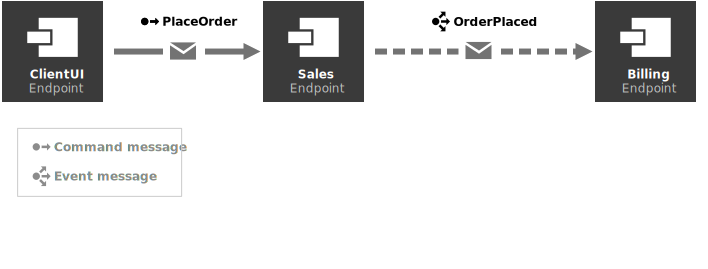
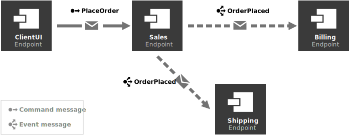

include: quickstart-tutorial-intro-paragraph

This tutorial skips over some concepts and implementation details in order to get up and running quickly. If you'd prefer to go more in-depth, check out our [Introduction to NServiceBus](/tutorials/intro-to-nservicebus/) tutorial. It will teach you the NServiceBus API and important concepts you need to learn to build successful message-based software systems.

To get started download the solution above, extract the archive, and then open the **Before/RetailDemo.sln** file with Visual Studio 2015 or later.


## Project structure

The solution contains four projects. The **ClientUI**, **Sales**, and **Billing** projects are [endpoints](/nservicebus/endpoints/) that communicate with each other using NServiceBus messages. The **ClientUI** endpoint mimics a web application and is an entry point in our system. The **Sales** and **Billing** endpoints contain business logic related to processing and fulfilling orders. Each endpoint references the **Messages** assembly, which contains the definitions of messages as POCO class files.


As shown in the diagram, the **ClientUI** endpoint sends a **PlaceOrder** command to the **Sales** endpoint. As a result, the **Sales** endpoint will publish an **OrderPlaced** event using the publish/subscribe pattern, which will be received by the **Billing** endpoint.



The solution mimics a real-life retail system, where [the command](/nservicebus/messaging/messages-events-commands.md#command) to place an order is sent as a result of a customer interaction, and the actual processing occurs in the background. Publishing [an event](/nservicebus/messaging/messages-events-commands.md#event) allows us to isolate the code to bill the credit card from the code to place the order, reducing coupling and making the system easier to maintain over the long term. Later in this tutorial, we'll see how to add a second subscriber in the **Shipping** endpoint which would begin the process of shipping the order.


## Running the solution

The solution is configured to have [multiple startup projects](https://msdn.microsoft.com/en-us/library/ms165413.aspx), so when you run the solution it should open three console applications, one for each messaging endpoint.

In the **ClientUI** application, press `P` to place an order, and watch what happens in other windows. 

It may happen too quickly to see, but the **PlaceOrder** command will be sent to the **Sales** endpoint. In the **Sales** endpoint window you should see:

```
INFO  Sales.PlaceOrderHandler Received PlaceOrder, OrderId = 9b16a5ce-e6ae-4447-a911-b7d6e265a1f0
```

Then the **Sales** endpoint will publish an **OrderPlaced** event, which will be received by the **Billing** endpoint. In the **Billing** endpoint window you should see:

```
INFO  Billing.OrderPlacedHandler Billing has received OrderPlaced, OrderId = 9b16a5ce-e6ae-4447-a911-b7d6e265a1f0
```

Press the `P` key repeatedly in the **ClientUI** window and watch the messages flow between endpoints.


## Reliability

One of the most powerful advantages of asynchronous messaging is reliability. Failures in one part of a system aren't propagated and don't bring the whole system down. 

See how that is achieved by following these steps:

1. Run the solution in Visual Studio and ensure all three console windows are active.
1. Close the **Billing** window.
1. Send several messages by pressing `P` in the **ClientUI** window.
1. Notice how messages are flowing from **ClientUI** to **Sales**. **Sales** is still publishing messages, even though **Billing** can't process them at the moment.
1. Restart the **Billing** application by right-clicking the **Billing** project in Visual Studio's Solution Explorer, then selecting **Debug** > **Start new instance**.

When the **Billing** endpoint starts, it will pick up messages published earlier by **Sales** and will complete the process for orders that were waiting to be billed.

Let's consider more carefully what happened. First, we had two processes communicating with each other with very little ceremony. The communication didn't break down even when the **Billing** service was unavailable. If we had implemented **Billing** as a REST endpoint, the **Sales** service would have thrown an HTTP exception when it was unable to communicate with it and *that request would have been lost*. By using NServiceBus we get a guarantee that even if message processing endpoints are temporarily unavailable, every message will eventually get delivered and processed.


## Transient failures

Have you ever had business processes get interrupted by transient errors like database deadlocks? Transient errors often leave a system in an inconsistent state. For example, the order could be persisted in the database but not yet submitted to the payment processor. In such a situation you might have to investigate the database like a forensic analyst, trying to figure out where the process went wrong, and how to manually jump-start it so that the process can complete.

With NServiceBus you don't need manual interventions. If an exception is thrown, then the message handler will automatically retry processing it. That addresses transient failures like database deadlocks, connection issues across machines, conflicts when accessing file to write, etc.

Let's simulate a transient failure in the **Sales** endpoint and see retries in action:

1. In the **Sales** endpoint, locate and open the **PlaceOrderHandler.cs** file.
1. Uncomment the code inside the **ThrowTransientException** region shown here. This will cause an exception to be thrown 20% of the time a message is processed:

snippet: ThrowTransientException

3. Start the solution without debugging (Ctrl+F5), or alternatively, start the solution and then select **Detach All** in the **Debug** menu. This will make it easier to observe exceptions occurring without being interrupted by Visual Studio's Exception Assistant.
3. In the **ClientUI** window, send one message at a time by pressing `P`, and watch the **Sales** window.

As you will see in the **Sales** window, 80% of the messages will go through as normal, but when an exception occurs, the output will be different:

```
INFO  NServiceBus.RecoverabilityExecutor Immediate Retry is going to retry message '43400b29-c235-471f-ab4f-a7760145ea88' because of an exception:
System.Exception: Oops
    at <long stack trace>
INFO  Sales.PlaceOrderHandler Received PlaceOrder, OrderId = e1d86cb9-c393-475b-9be0-5407e9e529e0
```

NOTE: If you forgot to detach the debugger, you'll need to click the **Continue** button before the message will be printed in the **Sales** window.

5. Comment the code inside the **ThrowTransientException** region, so no exceptions are thrown in the future.

Automatic retries allow us to avoid losing data or having our system left in an inconsistent state because of a random transient exception. We won't need to manually dig through the database to fix things anymore!

Of course, there are other exceptions that may be harder to recover from than simple database deadlocks. NServiceBus contains more [recoverability tools](/nservicebus/recoverability/) to handle various types of failures and ensure that no message is ever lost.


## Extending the system

As mentioned previously, publishing events using the [Publish-Subscribe pattern](/nservicebus/messaging/publish-subscribe/) reduces coupling and makes maintaining a system easier in the long run. Let's look at how we can add an additional subscriber without needing to modify any existing code.

As shown in the diagram, we'll be adding a new messaging endpoint called **Shipping** that will also subscribe to the `OrderPlaced` event.




### Create a new endpoint

First we'll create the **Shipping** project and set up its dependencies:

1. In the **Solution Explorer** window, right-click the **RetailDemo** solution and select **Add** > **New Project**.
1. In the **Add New Project** dialog, be sure to select at least **.NET Framework 4.6.1** in the dropdown menu at the top of the window for access to the `Task.CompletedTask` API.
1. Select a new **Console App (.NET Framework)** project (or just **Console Application**) and name it **Shipping**.
1. Click **OK** to create the project and add it to the solution.
1. In the newly created **Shipping** project, add the `NServiceBus` NuGet package, which is already present in the other projects in the solution. In the Package Manager Console window type:
    ```
    Install-Package NServiceBus -ProjectName Shipping
    ```
1. In the **Shipping** project, add a reference to the **Messages** project, so that we have access to the `OrderPlaced` event.

Now that we have a project for the Shipping endpoint, we need to add some code to configure and start an `NServiceBus` endpoint:

snippet: ShippingProgram

You'll want the **Shipping** endpoint to run when you debug the solution, so use Visual Studio's [multiple startup projects](https://msdn.microsoft.com/en-us/library/ms165413.aspx) feature to configure the **Shipping** endpoint to start along with **ClientUI**, **Sales**, and **Billing**.


### Create a new message handler

Next, we need a message handler to process the `OrderPlaced` event. When NServiceBus starts, it will detect the message handler and handle subscribing to the event automatically.

To create the message handler:

1. In the **Shipping** project, create a new class named `OrderPlacedHandler`.
1. Mark the handler class as public, and implement the `IHandleMessages<OrderPlaced>` interface.
1. Add a logger instance, which will allow us to take advantage of the logging system used by NServiceBus. This has an important advantage over `Console.WriteLine()`: the entries written with the logger will appear in the log file in addition to the console. Use this code to add the logger instance to the handler class:
    ```cs
    static ILog log = LogManager.GetLogger<OrderPlacedHandler>();
    ```
1. Within the `Handle` method, use the logger to record when the `OrderPlaced` message is received, including the value of the `OrderId` message property:
    ```cs
    log.Info($"Shipping has received OrderPlaced, OrderId = {message.OrderId}");
    ```
1. Since everything we have done in this handler method is synchronous, return `Task.CompletedTask`.

When complete, the `OrderPlacedHandler` class should look like this:

snippet: OrderPlacedHandler


### Run the updated solution

Now run the solution, and assuming you remembered to [update the startup projects](https://msdn.microsoft.com/en-us/library/ms165413.aspx), a window for the **Shipping** endpoint will open in addition to the other three.

As you place orders by pressing `P` in the **ClientUI** window, you will see the **Shipping** endpoint reacting to `OrderPlaced` events:

```
INFO Shipping.OrderPlacedHandler Shipping has received OrderPlaced, OrderId = 25c5ba63-eed8-4531-9caa-ffe353105ee1
```

**Shipping** is now receiving events published by **Sales** without having to change the code in the **Sales** endpoint. Additional subscribers could be added, for example, to email a receipt to the customer, notify a fulfillment agency via a web service, update a wish list or gift registry, or update data on items that are frequently bought together. Each business activity would occur in its own isolated message handler and doesn't depend on what happens in other parts of the system.


## Summary

In this tutorial, we explored the basics of how a messaging system using NServiceBus works.

We learned that asynchronous messaging failures in one part of a system can be isolated and prevent the entire system failure. That level of resilience and reliability is not easy to achieve with traditional REST-based web services.

We saw how automatic retries provide protection from transient failures like database deadlocks. If we implement a multi-step process as a series of message handlers, then each step will be executed independently and can be automatically retried in case of failures. This means that a stray exception won't abort an entire process, leaving the system in an inconsistent state.

We also implemented an additional event subscriber, showing how to decouple independent bits of business logic from each other. The ability to publish one event and then implement resulting steps in separate message handlers makes the system much easier to maintain and evolve.

SUCCESS: Now that you've seen what NServiceBus can do, take the next step and learn how to build a system like this one from the ground up. In the next tutorial, find out how to build the same solution starting from File > New Project.
