include: quickstart-tutorial-intro-paragraph

This tutorial skips over some concepts and implementation details in order to get up and running quickly. If you'd prefer to go more in-depth, check out our [NServiceBus step-by-step tutorial](/tutorials/nservicebus-step-by-step/). It will teach you the NServiceBus API and important concepts necessary to learn how to build successful message-based software systems.

## Download solution

The demo solution doesn't require any prerequisites—no message queue or database to install, just Visual Studio. To get started, download the solution, extract the archive, and then open the **RetailDemo.sln** file. 

downloadbutton

<style type="text/css">
  /* Remove borders on images as they all have appropriate borders */
  img.center { border-style: none !important; }
</style>


## Project structure

The solution contains five projects. The **ClientUI**, **Sales**, and **Billing** projects are [endpoints](/nservicebus/endpoints/) that communicate with each other using NServiceBus messages. The **ClientUI** endpoint is implemented as a web application and is the entry point to our system. The **Sales** and **Billing** endpoints, implemented as console applications, contain business logic related to processing and fulfilling orders. Each endpoint references the **Messages** assembly, which contains the definitions of messages as simple class files. The **Platform** project will provide a demonstration of the Particular Service Platform, but initially, its code is commented out.

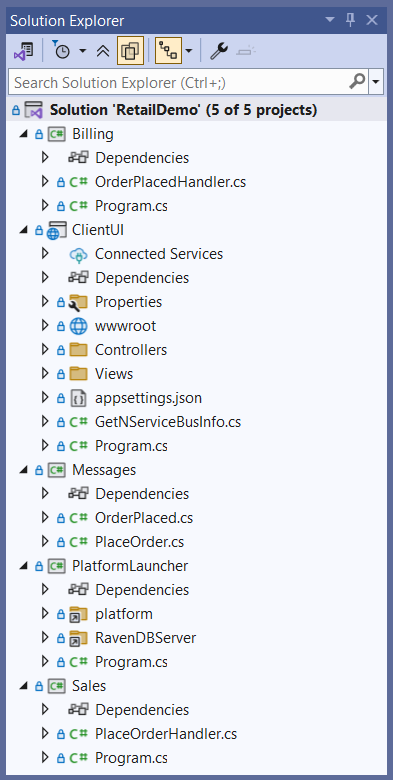

As shown in the diagram below, the **ClientUI** endpoint sends a **PlaceOrder** command to the **Sales** endpoint. As a result, the **Sales** endpoint will publish an **OrderPlaced** event using the publish/subscribe pattern, which will be received by the **Billing** endpoint.


The solution mimics a real-life retail system where [the command](/nservicebus/messaging/messages-events-commands.md) to place an order is sent as a result of customer interaction, and the processing occurs in the background. Publishing [an event](/nservicebus/messaging/messages-events-commands.md) allows us to isolate the code to bill the credit card from the code to place the order, reducing coupling and making the system easier to maintain over the long term. Later in this tutorial, we'll see how to add a second subscriber in a new **Shipping** endpoint which will begin the process of shipping the order.


## Running the solution

The solution is configured to have [multiple startup projects](https://docs.microsoft.com/en-us/visualstudio/ide/how-to-set-multiple-startup-projects), so when we run the solution (**Debug** > **Start Debugging** or press <kbd>F5</kbd>) it should open three console applications, one for each messaging endpoint. One of these will open the web application in your browser. (The Particular Service Platform Launcher console app will also open but not do anything. Depending on your version of Visual Studio, it may persist or immediately close.)

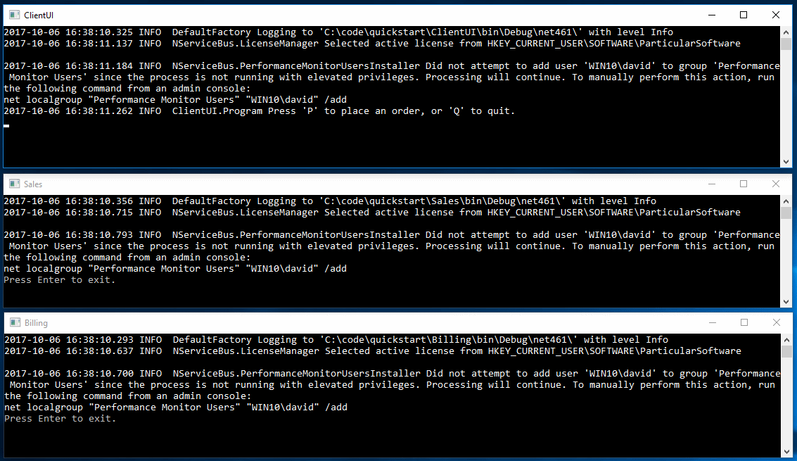
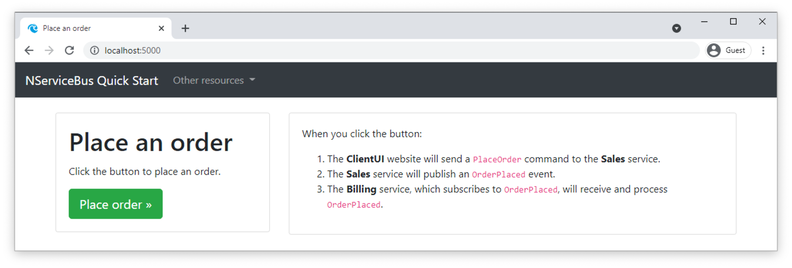

{{WARNING: Did all three windows appear?
  - For [Visual Studio Code](https://code.visualstudio.com/) users, ensure the _Debug All_ launch configuration is selected from the dropdown list under the _Run and Debug_ tab.
  - In versions prior to Visual Studio 2019 16.1, there is a bug ([Link 1](https://developercommunity.visualstudio.com/content/problem/290091/unable-to-launch-the-previously-selected-debugger-1.html), [Link 2](https://developercommunity.visualstudio.com/content/problem/101400/unable-to-launch-the-previously-selected-debugger.html?childToView=583221#comment-583221)) that will sometimes prevent one or more projects from launching with an error message. If this is the case, stop debugging and try again. The problem usually happens only on the first attempt.}}

In the **ClientUI** web application, click the **Place order** button to place an order, and watch what happens in other windows.

It may happen too quickly to see, but the **PlaceOrder** command will be sent to the **Sales** endpoint. In the **Sales** endpoint window we see:

```
INFO Received PlaceOrder, OrderId = 9b16a5ce
INFO Publishing OrderPlaced, OrderId = 9b16a5ce
```

As shown in the log, the **Sales** endpoint then publishes an **OrderPlaced** event, which will be received by the **Billing** endpoint. In the **Billing** endpoint window we see:

```
INFO Billing has received OrderPlaced, OrderId = 9b16a5ce
```

In the **ClientUI** web application, go back and send more messages, watching the messages flow between endpoints.

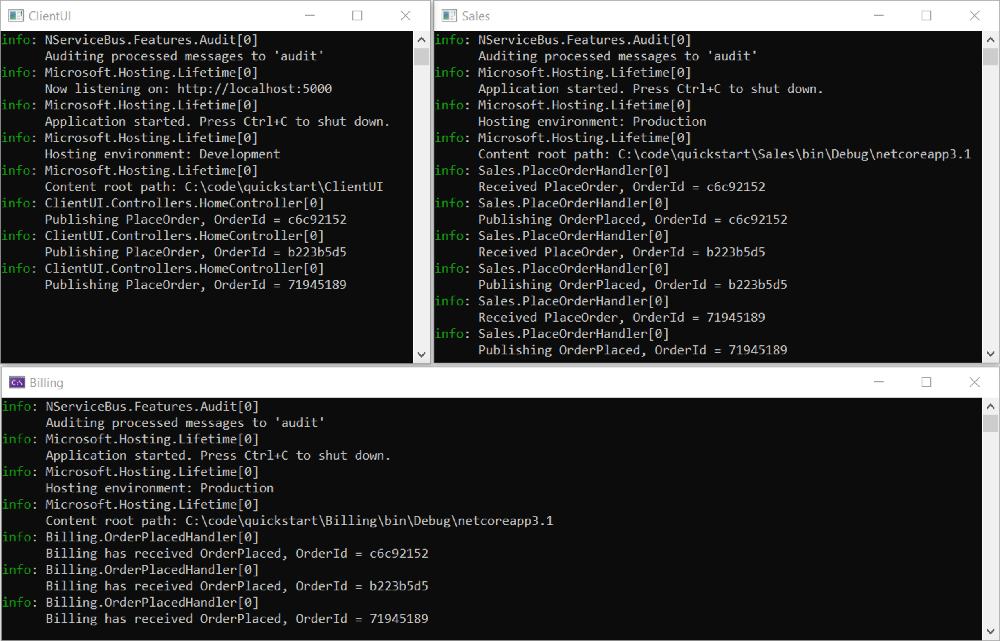


## Reliability

One of the most powerful advantages of asynchronous messaging is reliability. Failures in one part of a system aren't propagated and won't bring the whole system down. 

See how that is achieved by following these steps:

1. Stop the solution (if you haven't already) and then in Visual Studio's **Debug** menu, select **Start Without Debugging** or use <kbd>Ctrl</kbd>+<kbd>F5</kbd>. This will allow us to stop one endpoint without Visual Studio closing all three.
2. Close the **Billing** window.
3. Send several messages using the button in the **ClientUI** window.
4. Notice how messages are flowing from **ClientUI** to **Sales**. **Sales** is still publishing messages, even though **Billing** can't process them at the moment.

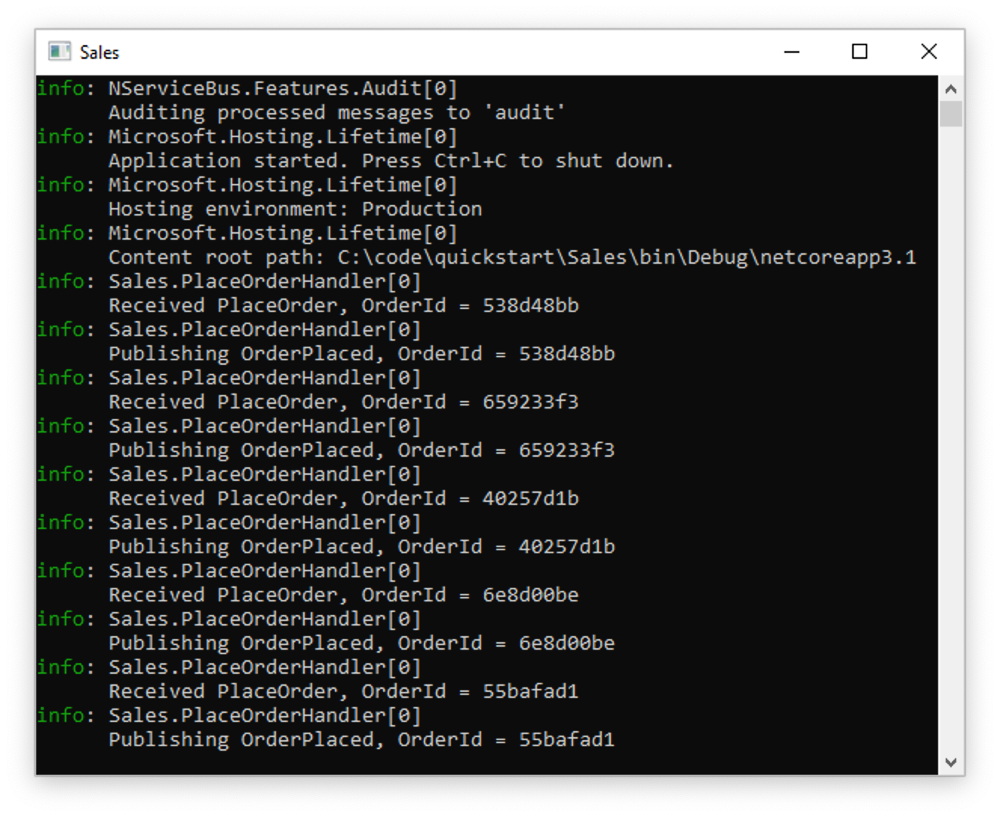

5. Restart the **Billing** application by right-clicking the **Billing** project in Visual Studio's Solution Explorer, then selecting **Debug** > **Start new instance**.

NOTE: For Visual Studio Code users, the **Billing** endpoint can be started by navigating to the _Run and Debug_ tab and selecting the _Billing_ launch configuration from the dropdown list. Be sure to re-select the _Debug All_ configuration again after _Billing_ is running.  

When the **Billing** endpoint starts, it will pick up messages published earlier by **Sales** and will complete the process for orders that were waiting to be billed.

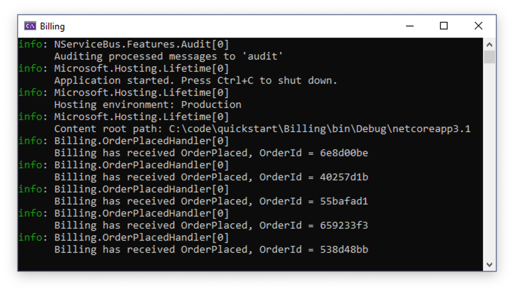

Let's consider more carefully what happened. First, we had two processes communicating with each other with very little ceremony. The communication didn't break down even when the **Billing** service was unavailable. Had we implemented **Billing** as a REST service, for example, the **Sales** service would have thrown an HTTP exception when it was unable to communicate, *resulting in a lost request*. By using NServiceBus we get a guarantee that even if message processing endpoints are temporarily unavailable, every message will eventually get delivered and processed.


## Transient failures

Have you ever had business processes get interrupted by transient errors like database deadlocks? Transient errors often leave a system in an inconsistent state. For example, an order could be persisted in the database but not yet submitted to the payment processor. In such a situation you may have to investigate the database like a forensic analyst, trying to figure out where the process went wrong, and how to manually jump-start it so the process can complete.

With NServiceBus we don't need manual intervention. If an exception is thrown, the message handler will automatically attempt a retry. The automatic retry process addresses transient failures like database deadlocks, connection issues, file write access conflicts, etc.

Let's simulate a transient failure in the **Sales** endpoint and see the retry process in action:

1. Stop the solution if you haven't already. Locate and open the **PlaceOrderHandler.cs** file in the **Sales** endpoint.
1. Uncomment the code inside the **ThrowTransientException** region shown below. This will cause an exception to be thrown 20% of the time a message is processed:

snippet: ThrowTransientException

3. Start the solution without debugging (<kbd>Ctrl</kbd>+<kbd>F5</kbd>). This will make it easier to observe exceptions occurring without being interrupted by Visual Studio's Exception Assistant dialog. If you are using Visual Studio Code, the browser window may not reopen. If this is the case, open [http://localhost:5000](http://localhost:5000) in a new tab.
4. In the **ClientUI** window, send one message at a time, and watch the **Sales** window.

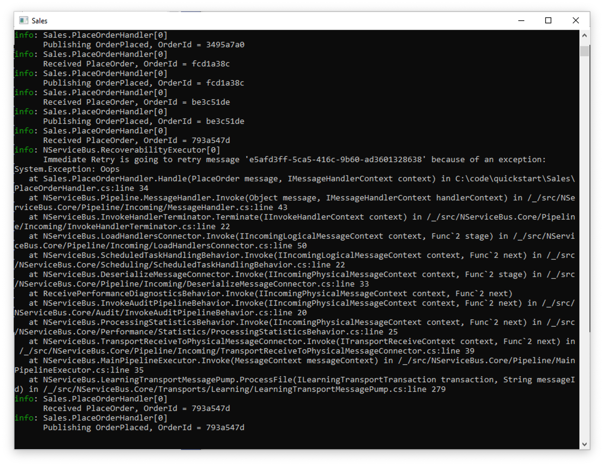

As we can see in the **Sales** window, 80% of the messages will go through as normal, but when an exception occurs, the output will be different. The first attempt of `PlaceOrderHandler` will throw and log an exception, but then in the very next log entry, processing will be retried and likely succeed.

```
INFO Immediate Retry is going to retry message '5154b012-4180-4b56-9952-a90a01325bfc' because of an exception:
System.Exception: Oops
    at <long stack trace>
INFO Received PlaceOrder, OrderId = e1d86cb9
```

NOTE: If you didn't detach the debugger, you must click the **Continue** button in the Exception Assistant dialog before the message will be printed in the **Sales** window.

5. Stop the solution and re-comment the code inside the **ThrowTransientException** region, so no exceptions are thrown in the future.

Automatic retries allow us to avoid losing data or having our system left in an inconsistent state because of a random transient exception. We won't need to manually dig through the database to fix things anymore!

Of course, there are other exceptions that may be harder to recover from than simple database deadlocks. Let's see what happens when a systemic failure occurs.

## Systemic failures

WARNING: In order to use the portable version of the Particular Service Platform included in this tutorial, you'll need to use a Windows operating system.

A systemic failure is one that is simply unrecoverable, no matter how many times we retry. Usually these are just plain old bugs. Most of the time these kinds of failures require a redeployment with new code in order to fix. But what happens to the messages when this happens?

NOTE: For a good introduction to different types of errors and how to handle them with message-based systems, see [I caught an exception. Now what?](https://particular.net/blog/but-all-my-errors-are-severe)

Let's cause a systemic failure and see how we can use the Particular Service Platform tools to handle it.

First, let's simulate a systemic failure in the **Sales** endpoint:

1. In the **Sales** endpoint, locate and open the **PlaceOrderHandler.cs** file.
2. Uncomment the code inside the **ThrowFatalException** region shown here. This will cause an exception to be thrown every time the `PlaceOrder` message is processed:

snippet: ThrowFatalException

3. In the `Handle` method, comment out all the code past the `throw` statement so that Visual Studio doesn't show a warning about unreachable code.

Next, let's enable the Particular Service Platform tools and see what they do.

1. In the **Platform** project, locate and open the **Program.cs** file.
2. Uncomment the code inside the **Main** method shown here. This will cause the platform to launch when we start our project.

snippet: PlatformMain

With those two changes made, start the solution without debugging (<kbd>Ctrl</kbd>+<kbd>F5</kbd>). This will make it easier to observe the exceptions and retries without being interrupted by Visual Studio's Exception Assistant dialog.

Along with the windows from before, two new windows will now launch. The first is the **Particular Service Platform Launcher** window, which looks like this:

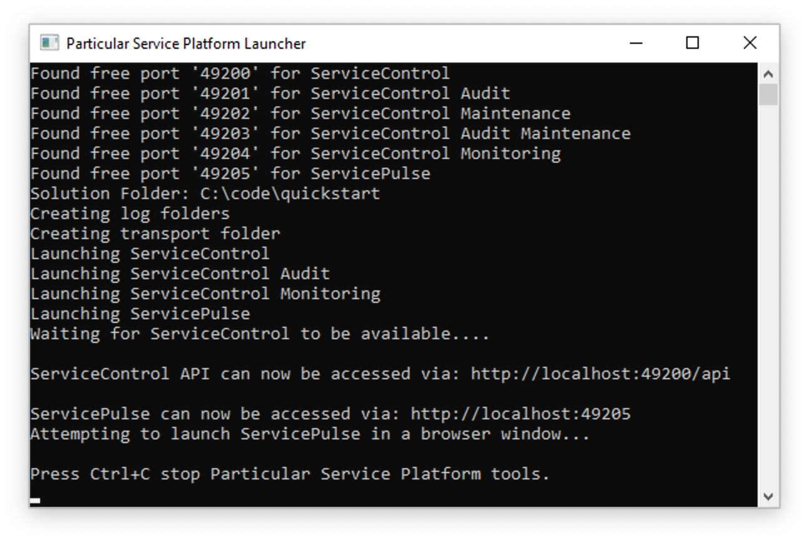

The purpose of this app is to host different tools within a sandbox environment, just for this solution. After a few seconds, the application launches ServicePulse in a new browser window:

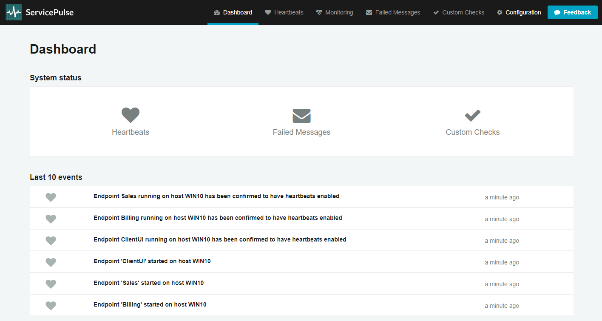

The screenshot shows how ServicePulse monitors the operational health of your system. It tracks **Heartbeats** from your messaging endpoints, ensuring that they are running and able to send messages. It tracks **Failed Messages** and allows you to retry them. It also supports **Custom Checks** allowing you to write code that checks the health of your external dependencies (such as connectivity to a web service or FTP server) so you can get a better idea of the overall health of your system.

Another feature of ServicePulse is the **Monitoring** view, which tracks performance statistics for your endpoints:

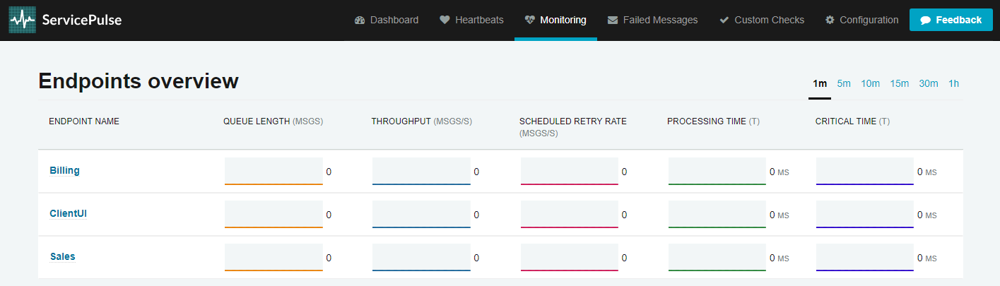

For a more in-depth look at the monitoring capabilities, check out the [Monitoring Demo](/tutorials/monitoring-demo/), which includes a load simulator to create monitoring graphs that aren't flatlined at zero.

For now, let's focus on the **Failed Messages** view. It's not much to look at right now (and that's good!) so let's generate a systemic failure:

1. Undock the ServicePulse browser tab into a new window to better see what's going on.
2. In the **ClientUI** window, send one message while watching the **Sales** window.

Immediately, we see an exception flash past, followed by an orange WARN message:

```
WARN  NServiceBus.RecoverabilityExecutor Delayed Retry will reschedule message 'ea962f05-7d82-4be1-926a-a9de01749767' after a delay of 00:00:02 because of an exception:
System.Exception: BOOM
   at <long stack trace>
```

Two seconds later, text will flash past again, warning of a 4-second delay. Four seconds later, the text will flash again, warning of a 6-second delay. And finally, six seconds after that, text will flash by again, ending with a red ERROR message:

```
ERROR NServiceBus.RecoverabilityExecutor Moving message 'ea962f05-7d82-4be1-926a-a9de01749767' to the error queue 'error' because processing failed due to an exception:
System.Exception: BOOM
   at <long stack trace>
```

Once the red stack trace appears, check out the **Failed Messages** view in the **ServicePulse** window:

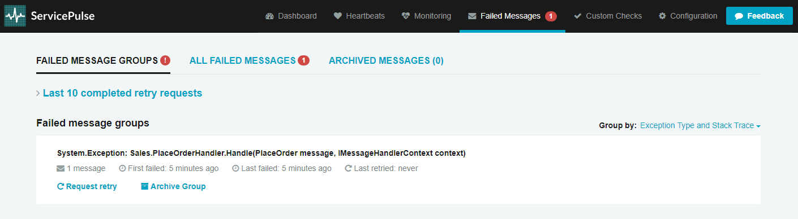

So what happened here? Due to the hard-coded exception, the message couldn't be successfully processed. And just like before in the [Transient failures](#transient-failures) section, NServiceBus immediately attempted a round of retries. When every retry attempt failed, before giving up all hope, the system attempted another round of retires after a delay. Failing that, NServiceBus repeated this cycle 2 more times, increasing the delay each time. After all of the retries and delays were exhausted, the message still couldn't be processed successfully and the system transferred the message to an **error queue**, a holding location for poison messages, so that other messages behind it can be processed.

INFO: By default, NServiceBus will perform rounds of [immediate retries](/nservicebus/recoverability/#immediate-retries) separated by a series of [increasing delays](/nservicebus/recoverability/#delayed-retries). The endpoints here have been [configured for shorter delays](/nservicebus/recoverability/configure-delayed-retries.md) so that we can quickly see the endpoint arrive in the error queue.

Once the message entered the error queue, ServicePulse took over, displaying all failed messages grouped by exception type and the location it was thrown from.

If you click on the exception group, it will take you to the list of exceptions within that group. This is not very interesting since we currently only have one, but if you click again on the individual exception, you will get a rich exception detail view:

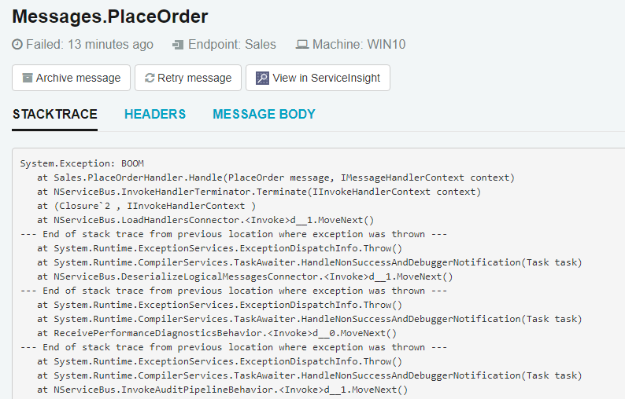

No need to go digging through log files to find out what went wrong. ServicePulse provides the exception's stack trace, message headers, and message body right here.

Armed with this information, it should be much easier to track down and fix our bug, so let's do that:

1. Close both browser windows and all console applications.
1. In the **Sales** endpoint, locate and open the **PlaceOrderHandler.cs** file.
1. Comment out the `throw` statement, and uncomment all the code below the **ThrowFatalException** region, returning the code to its original working state.
1. Start the solution again. It won't throw any exceptions so it's okay to attach the debugger this time.
2. Once the **ServicePulse** window launches, navigate to the **Failed Messages** view.

Now our system has been fixed, and we can give that failed message another chance.

1. Move the **Sales** and **Billing** windows around so you can see what happens when you retry the message.
2. In the **ServicePulse** window, click the **Request Retry** link.
3. In the confirmation dialog, click **Yes**, and watch the **Sales** and **Billing** windows.
4. It may take several seconds to enqueue the batch, but eventually you will see the familiar log messages in **Sales** and **Billing**, showing the message being processed successfully as if nothing bad ever happened.

This is a powerful feature. Many systemic failures are the result of bad deployments. A new version is rolled out with a bug, and errors suddenly start appearing that ultimately result in lost data.

With a message-based system, no data is ever lost, because those failures result in messages being sent to an error queue, not lost to the ether. After a deployment, you can watch ServicePulse, and if messages start to pile up in the error queue, you can revert to the previous known good configuration while you diagnose the problem.

The visual tools in ServicePulse provide a quick way to get to the root cause of a problem and develop a fix. Once deployed, all affected messages (even into the thousands) can be replayed with just a few mouse clicks.

## Extending the system

As mentioned previously, publishing events using the [Publish-Subscribe pattern](/nservicebus/messaging/publish-subscribe/) reduces coupling and makes maintaining a system easier in the long run. Let's look at how we can add an additional subscriber without needing to modify any existing code.

As shown in the diagram, we'll be adding a new messaging endpoint called **Shipping** that will subscribe to the `OrderPlaced` event.


NOTE: In this tutorial, we'll use terminal commands like [`dotnet new`](https://docs.microsoft.com/en-us/dotnet/core/tools/dotnet-new), [`dotnet add package`](https://docs.microsoft.com/en-us/dotnet/core/tools/dotnet-add-package), and [`dotnet add reference`](https://docs.microsoft.com/en-us/dotnet/core/tools/dotnet-add-reference), but you can do the same things using the graphical tools in Visual Studio if you prefer.

### Create a new endpoint

First we'll create the **Shipping** project and set up its dependencies.

First let's make sure both browser windows and all console appliations are closed, and in the terminal,  we're in the root of the project where the **RetailDemo.sln** file is located:

```shell
> cd tutorials-quickstart
```

Next, we'll create a new Console Application project named **Shipping** and add it to the solution:

```shell
> dotnet new console --name Shipping --framework netcoreapp3.1
> dotnet sln add Shipping
```

Now, we need to add references to the **Messages** project, as well as the NuGet packages we will need.

```shell
> dotnet add Shipping reference Messages

> dotnet add Shipping package NServiceBus
> dotnet add Shipping package NServiceBus.Extensions.Hosting
> dotnet add Shipping package NServiceBus.Heartbeat
> dotnet add Shipping package NServiceBus.Metrics.ServiceControl
```

Now that we have a project for the Shipping endpoint, we need to add some code to configure and start an `NServiceBus` endpoint. In the **Shipping** project, find the auto-generated **Program.cs** file and replace its contents with the following.

snippet: ShippingProgram

Take special note of the comments in this code, which annotate the various parts of the NServiceBus configuration we're using.

We want the **Shipping** endpoint to run when you debug the solution, so use Visual Studio's [multiple startup projects](https://docs.microsoft.com/en-us/visualstudio/ide/how-to-set-multiple-startup-projects) feature to configure the **Shipping** endpoint to start along with **ClientUI**, **Sales**, and **Billing**.

NOTE:  To launch the Shipping endpoint with the rest of the solution when using Visual Studio Code, navigate to the _Run and Debug_ tab and select the _Debug All + Shipping_ launch configuration from the dropdown list.

### Create a new message handler

Next, we need a message handler to process the `OrderPlaced` event. When NServiceBus starts, it will detect the message handler and handle subscribing to the event automatically.

To create the message handler:

1. In the **Shipping** project, create a new class named `OrderPlacedHandler`.
1. Mark the handler class as public, and implement the `IHandleMessages<OrderPlaced>` interface.
1. Add a logger instance, which will allow us to take advantage of the logging system used by NServiceBus. This has an important advantage over `Console.WriteLine()`: the entries written with the logger will appear in the log file in addition to the console. Use this code to add the logger instance to the handler class:
    ```cs
    static ILog log = LogManager.GetLogger<OrderPlacedHandler>();
    ```
1. Within the `Handle` method, use the logger to record when the `OrderPlaced` message is received, including the value of the `OrderId` message property:
    ```cs
    log.Info($"Shipping has received OrderPlaced, OrderId = {message.OrderId}");
    ```
1. Since everything we have done in this handler method is synchronous, return `Task.CompletedTask`.

When complete, the `OrderPlacedHandler` class should look like this:

snippet: OrderPlacedHandler


### Run the updated solution

Now run the solution, and assuming you remembered to [update the startup projects](https://msdn.microsoft.com/en-us/library/ms165413.aspx), a window for the **Shipping** endpoint will open in addition to the other three.

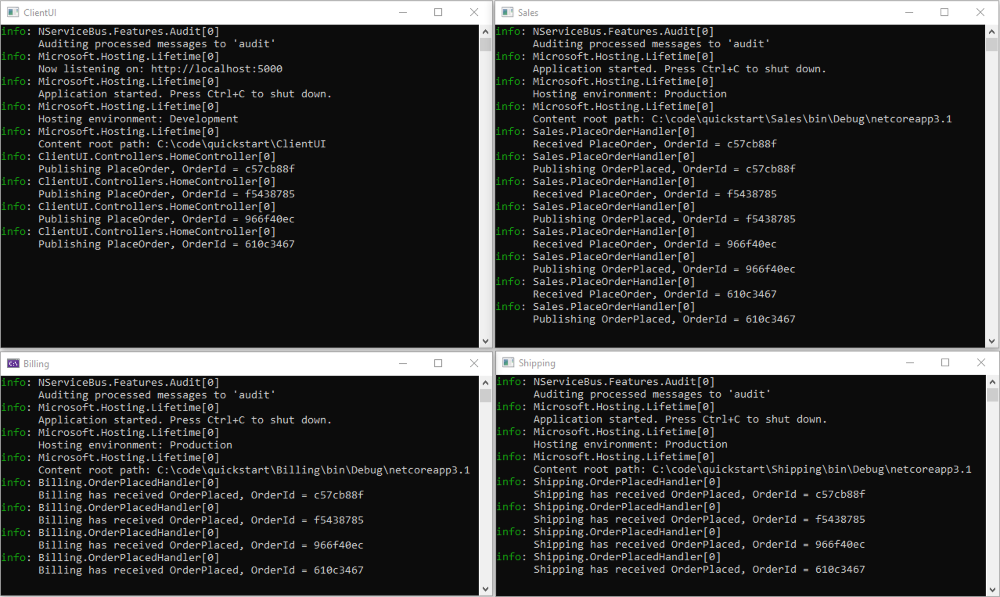

As you place orders by clicking the button in the **ClientUI** web view, you will see the **Shipping** endpoint reacting to `OrderPlaced` events:

```
INFO Shipping has received OrderPlaced, OrderId = 25c5ba63
```

**Shipping** is now receiving events published by **Sales** without having to change the code in the **Sales** endpoint. Additional subscribers could be added, for example, to email a receipt to the customer, notify a fulfillment agency via a web service, update a wish list or gift registry, or update data on items that are frequently bought together. Each business activity would occur in its own isolated message handler and doesn't depend on what happens in other parts of the system.

NOTE: You may also want to take a look at the ServicePulse window, where you should now be able to see heartbeat and endpoint monitoring information for the new endpoint as well.


## Summary

In this tutorial, we explored the basics of how a messaging system using NServiceBus works.

We learned that asynchronous messaging failures in one part of a system can be isolated and prevent complete system failure. This level of resilience and reliability is not easy to achieve with traditional REST-based web services.

We saw how automatic retries provide protection from transient failures like database deadlocks. If we implement a multi-step process as a series of message handlers, then each step will be executed independently and can be automatically retried in case of failures. This means that a stray exception won't abort an entire process, leaving the system in an inconsistent state.

We saw how the tooling in the Particular Service Platform makes running a distributed system much easier. ServicePulse gives us critical insights into the health of a system, and allows us to diagnose and fix systemic failures. We don't have to worry about data loss—once we redeploy our system, we can replay failed messages in batches as if the error had never occurred.

We also implemented an additional event subscriber, showing how to decouple independent bits of business logic from each other. The ability to publish one event and then implement resulting steps in separate message handlers makes the system much easier to maintain and evolve.

SUCCESS: Now that you've seen what NServiceBus can do, take the next step and learn how to build a system like this one from the ground up. In the next tutorial, find out how to build the same solution starting from **File** > **New Project**.

<style type="text/css">
  .btn-outline {
    border: 1px solid #00A3C4;
    background-color: #fff;
    color: #00A3C4;
    margin-right: 15px;
    padding-left: 45px;
    background: url('tweet.svg') no-repeat left 15px top 11px / 22px 22px;
  }

  .btn-outline:hover {
    background: url('tweet-hover.svg') no-repeat left 15px top 11px / 22px 22px, #00A3C4;
  }
</style>

<script src="//platform.twitter.com/oct.js" type="text/javascript"></script>
<script async src="https://www.googletagmanager.com/gtag/js?id=AW-691241604"></script>
<script type="text/javascript">
  // Twitter view
  window.twttr && twttr.conversion.trackPid('o3bkg', { tw_sale_amount: 0, tw_order_quantity: 0 });
  window.dataLayer = window.dataLayer || [];
  function gtag(){dataLayer.push(arguments);}
  gtag('js', new Date());
  gtag('config', 'AW-691241604', {'transport_type': 'beacon'});
  // Google view
  gtag('event', 'conversion', {'send_to': 'AW-691241604/vSZvCJ-K78kBEISFzskC'});
  (function () {
    var onJQuery = function () {
      $('.inline-download .dropdown-menu a:first').click(function(e) {
        // Twitter download
        twttr.conversion.trackPid('o3ay4', { tw_sale_amount: 0, tw_order_quantity: 0 });
        // Google download
        gtag('event', 'conversion', {
          'send_to': 'AW-691241604/ERjYCIn31ckBEISFzskC',
          'transaction_id': ''
        });
      });
      $(function () {
        $('.tutorial-actions').prepend('<a href="#" id="tweet-completion" class="btn btn-outline btn-info btn-lg">Share your accomplishment</a>');
        $('#tweet-completion').on('click', function (e) {
          e.preventDefault();
          window.ga && window.ga('send', 'event', 'QuickStart', 'TweetCompletionClick');
          window.open('https://twitter.com/intent/tweet?text=' + encodeURIComponent('I just completed the #NServiceBus Quick Start tutorial at docs.particular.net/tutorials/quickstart'));
        });
      });
    };
    var init = function () {
      if(window.$) {
        onJQuery();
      } else {
        setTimeout(function() { init(); }, 500);
      }
    };
    init();
  }());
</script>
