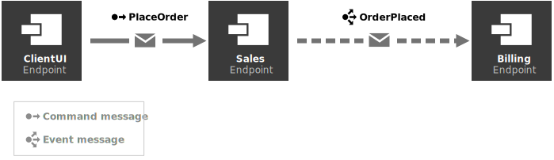

Want to learn what NServiceBus is all about? You're in the right place.

In less than an hour, the Demo retail store project will show you how to:

* Connect different parts of a system using messages
* Build a failure-resistant system using messages
* Create a system that can be easily extended as new requirements are added

If you've already experienced the benefits of messaging, you can check out our [NServiceBus step-by-step tutorial](/tutorials/nservicebus-step-by-step/) instead.

{{NOTE:
* If you haven't read about NServiceBus yet, we recommend to first [check this overview](https://particular.net/nservicebus).
* While following this tutorial, it is recommended to keep the [glossary of messaging terms](/nservicebus/concepts/glossary.md) at hand to easily understand any new concepts.
}}

## Download demo

The solution doesn't have any prerequisites — no message queue or database to install, just a compatible IDE. To get started, download the solution, extract the files, and then open the **RetailDemo.sln** file.

downloadbutton

<style type="text/css">
  /* Remove borders on images as they all have appropriate borders */
  img.center { border-style: none !important; }
</style>

## Project structure

The solution contains five projects. The **ClientUI**, **Sales**, and **Billing** projects are [endpoints](/nservicebus/endpoints/) that communicate with each other using NServiceBus messages. The **ClientUI** endpoint is implemented as a web application and is the entry point to our system. The **Sales** and **Billing** endpoints, are console applications, that contain business logic related to processing and fulfilling orders. Each endpoint project references the **Messages** assembly, which contains the shared definitions of messages as class files. The **Platform** project will provide a demonstration of the Particular Service Platform, but initially, its code is commented out.


## Initial workflow
The **ClientUI** endpoint sends a **PlaceOrder** command to the **Sales** endpoint. As a result, the **Sales** endpoint will publish an **OrderPlaced** event using the publish/subscribe pattern, which will be received by the **Billing** endpoint, as shown in the diagram below.



The solution mimics a real-life retail system where [the command](/nservicebus/messaging/messages-events-commands.md) to place an order is sent as a result of customer interaction, and the rest of the processing occurs in the background. Publishing [an event](/nservicebus/messaging/messages-events-commands.md) allows us to further isolate the component that bills the credit card from the one that places the order, reducing coupling and making the system easier to maintain in the long run. Later in this tutorial, you will see how to add a second subscriber to that event in a new **Shipping** endpoint which will begin the process of shipping the order.

## Running the solution

The solution is configured to have [multiple startup projects](https://docs.microsoft.com/en-us/visualstudio/ide/how-to-set-multiple-startup-projects), so when you run the solution (**Debug** > **Start Debugging** or press <kbd>F5</kbd>) it should open three console applications, one for each messaging endpoint. Additionally, one of these will open the web application in your browser. The Particular Service Platform Launcher console app will also open but not do anything. Depending on your IDE, it may persist or immediately close.


{{WARNING: Did all three windows appear?
  - For [Visual Studio Code](https://code.visualstudio.com/) users, ensure the _Debug All_ launch configuration is selected from the dropdown list under the _Run and Debug_ tab.
  - In versions prior to Visual Studio 2019 16.1, there is a bug ([Link 1](https://developercommunity.visualstudio.com/content/problem/290091/unable-to-launch-the-previously-selected-debugger-1.html), [Link 2](https://developercommunity.visualstudio.com/content/problem/101400/unable-to-launch-the-previously-selected-debugger.html?childToView=583221#comment-583221)) that will sometimes prevent one or more projects from launching with an error message. If this is the case, stop debugging and try again. The problem usually happens only on the first attempt.
  - For [Rider](https://www.jetbrains.com/rider/) users, follow the steps described on [their documentation](https://www.jetbrains.com/help/rider/Run_Debug_Multiple.html#multi_launch)}}

In the **ClientUI** web application, click the **Place order** button to place an order, and watch what happens on the other windows.

It may happen too quickly to see, but the **PlaceOrder** command will be sent to the **Sales** endpoint. 
In the **Sales** endpoint window you will see:

```
INFO Received PlaceOrder, OrderId = 9b16a5ce
INFO Publishing OrderPlaced, OrderId = 9b16a5ce
```

As shown, when the **Sales** endpoint receives an **PlaceOrder** command, it publishes an **OrderPlaced** event, which will be received by the **Billing** endpoint. 
In the **Billing** endpoint window you will see:

```
INFO Billing has received OrderPlaced, OrderId = 9b16a5ce
```

In the **ClientUI** web application, go back and send more messages, watching the messages flow between endpoints.


## Up next

Now that the project is up and running, let's break it!
