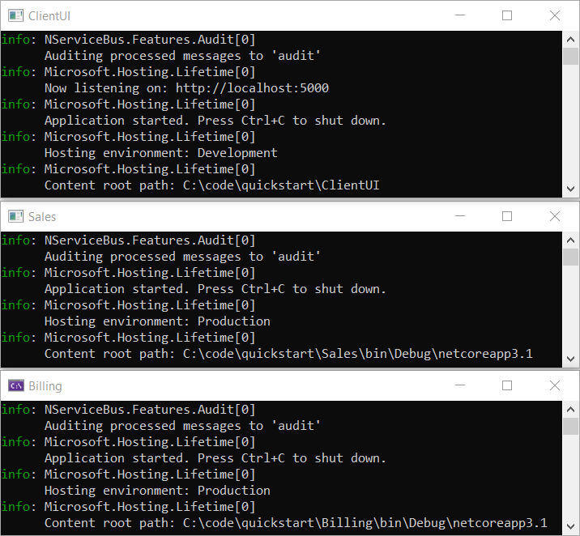

#variant Control

It is **very difficult** to build a distributed software system correctly from scratch. You _could_ read all 736 pages of the [Enterprise Integration Patterns](https://www.enterpriseintegrationpatterns.com/) book (an excellent though very dry reference) and then spend months creating, testing, and documenting a communication framework so that different services can talk to each other. Or instead, you could use a framework that incorporates all those design patterns and guides you straight into the [pit of success](https://blog.codinghorror.com/falling-into-the-pit-of-success/).

NServiceBus combines decades of distributed systems design experience and expertise and distills it into one easy-to-use framework. In this tutorial, you'll see how NServiceBus takes all the grunt work out of system design by handling all of the infrastructure complexity for you, taking system design best practices like reliability, failure recovery, and extensibility and baking them right into the software, guiding you toward the pit of success.

You'll also see how the additional tools in the Particular Service Platform make it easy to manage, monitor, and debug.

This tutorial skips over some concepts and implementation details in order to get up and running quickly. If you'd prefer to go more in-depth, check out our [NServiceBus step-by-step tutorial](/tutorials/nservicebus-step-by-step/). It will teach you the NServiceBus API and important concepts necessary to learn how to build successful message-based software systems.

## Download solution

The demo solution doesn't require any prerequisites — no message queue or database to install, just Visual Studio. To get started, download the solution, extract the archive, and then open the **RetailDemo.sln** file.

downloadbutton
#end-variant

#variant Variant

In this tutorial, you'll see how NServiceBus takes the grunt work out of system design by handling all the plumbing for you.

You'll explore part of an e-commerce system that handles receiving an order placed by a user, and the billing and shipping that goes with it. The final solution will look like this:


The tutorial has 3 parts—an introduction, failure recovery, and extensibility—that demonstrate how NServiceBus helps with best practices and how the Particular Service Platform helps monitor a distributed system. Each part takes about 15-20 minutes to complete.

To run this tutorial you’ll need:

- Experience with C#
- Windows
- .NET Core 3.1
- A C# IDE such as Visual Studio 2019 or later, Visual Studio Code, or JetBrains Rider.

To get up and running quickly, the tutorial skips over some concepts and implementation details. If you prefer to go more in-depth, check out our [NServiceBus step-by-step tutorial](/tutorials/nservicebus-step-by-step/). It will teach you the NServiceBus API and important concepts necessary to learn how to build successful message-based software systems.

## Download solution

The solution doesn't require installing any message queues or databases. Just download the solution, extract the archive, and open the **RetailDemo.sln** file.

<div class="text-center inline-download hidden-xs"> <div class="btn-group"> <button type="button" class="btn btn-primary btn-lg dropdown-toggle" data-toggle="dropdown" aria-haspopup="true" aria-expanded="false"> <span aria-hidden="true"></span> Download the solution now <span class="caret"></span> </button> <ul class="dropdown-menu docs-download"><li> <a href="https://quickstart-tutorial.s3.eu-central-1.amazonaws.com/tutorials-quickstart.zip" onclick="return fireGAEvent('TutorialDownloaded', '/tutorials/quickstart/tutorials-quickstart.zip' )"> <span class="glyphicon glyphicon-download-alt" aria-hidden="true"></span> Download for .NET Core 3.1 </a> </li></ul> </div></div>
#end-variant


<style type="text/css">
  /* Remove borders on images as they all have appropriate borders */
  img.center { border-style: none !important; }
</style>


## Project structure

The solution contains five projects. The **ClientUI**, **Sales**, and **Billing** projects are [endpoints](/nservicebus/endpoints/) that communicate with each other using NServiceBus messages. The **ClientUI** endpoint is implemented as a web application and is the entry point to our system. The **Sales** and **Billing** endpoints, implemented as console applications, contain business logic related to processing and fulfilling orders. Each endpoint references the **Messages** assembly, which contains the definitions of messages as simple class files. The **Platform** project will provide a demonstration of the Particular Service Platform, but initially, its code is commented out.


As shown in the diagram below, the **ClientUI** endpoint sends a **PlaceOrder** command to the **Sales** endpoint. As a result, the **Sales** endpoint will publish an **OrderPlaced** event using the publish/subscribe pattern, which will be received by the **Billing** endpoint.


The solution mimics a real-life retail system where [the command](/nservicebus/messaging/messages-events-commands.md) to place an order is sent as a result of customer interaction, and the processing occurs in the background. Publishing [an event](/nservicebus/messaging/messages-events-commands.md) allows us to isolate the code to bill the credit card from the code to place the order, reducing coupling and making the system easier to maintain over the long term. Later in this tutorial, we'll see how to add a second subscriber in a new **Shipping** endpoint which will begin the process of shipping the order.


## Running the solution

The solution is configured to have [multiple startup projects](https://docs.microsoft.com/en-us/visualstudio/ide/how-to-set-multiple-startup-projects), so when we run the solution (**Debug** > **Start Debugging** or press <kbd>F5</kbd>) it should open three console applications, one for each messaging endpoint. One of these will open the web application in your browser. (The Particular Service Platform Launcher console app will also open but not do anything. Depending on your version of Visual Studio, it may persist or immediately close.)




{{WARNING: Did all three windows appear?
  - For [Visual Studio Code](https://code.visualstudio.com/) users, ensure the _Debug All_ launch configuration is selected from the dropdown list under the _Run and Debug_ tab.
  - In versions prior to Visual Studio 2019 16.1, there is a bug ([Link 1](https://developercommunity.visualstudio.com/content/problem/290091/unable-to-launch-the-previously-selected-debugger-1.html), [Link 2](https://developercommunity.visualstudio.com/content/problem/101400/unable-to-launch-the-previously-selected-debugger.html?childToView=583221#comment-583221)) that will sometimes prevent one or more projects from launching with an error message. If this is the case, stop debugging and try again. The problem usually happens only on the first attempt.}}

In the **ClientUI** web application, click the **Place order** button to place an order, and watch what happens in other windows.

It may happen too quickly to see, but the **PlaceOrder** command will be sent to the **Sales** endpoint. In the **Sales** endpoint window we see:

```
INFO Received PlaceOrder, OrderId = 9b16a5ce
INFO Publishing OrderPlaced, OrderId = 9b16a5ce
```

As shown in the log, the **Sales** endpoint then publishes an **OrderPlaced** event, which will be received by the **Billing** endpoint. In the **Billing** endpoint window we see:

```
INFO Billing has received OrderPlaced, OrderId = 9b16a5ce
```

In the **ClientUI** web application, go back and send more messages, watching the messages flow between endpoints.


## Up next

Now that the project is up and running, let's break it!
